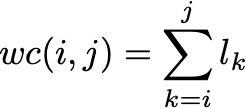
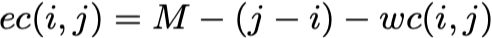
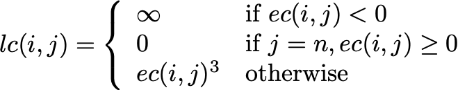

**Due: Fri, Mar 22th in class** Late assignments will be penalized 20% per day.

Book Questions from *Introduction to Algorithms - 4th ed.*
==========================================================

14.1-2, 14.1-3

14-4 (10 points)

15.1-4 (10 points)

*Hints:*

> 14.1-2 - Consider the following rod pricing table
>
> length |  1  |  2  |  3  |  4  |
> ------ | --- | --- | --- | --- |
> price  |  1  | 20  | 33  | 36  |
>
> Compute the density *p*i/*i* for each length, determine the greedy solution and compare it to the optimal solution.
>
> 14.1-3 - Consider how to modify **BOTTOM-UP-CUT-ROD** to incorporate the per cut cost (and the case where no cut is made).
> 
> 14-4 - This problem is *tricky* (as if any dynamic programming problem isn't). To start, define a quantity *wc(i,j)* as the count of the total number of characters in words *i* through *j*. 
>
> 
>
> Then we can compute the number of *extra spaces* at the end of a line of length *M* that contains words *i* through *j* as *es(i,j)* (note *es(i,j)* may be negative if the words are longer than the length of the line, i.e. the words don't fit on the line)
>
> 
>
> Then per the problem description, the cost of a line *lc(i,j)* is given by
>
> 
>
> where the first case precludes solutions where the words don't fit, the second case accounts for the last line, and the third case is the *cubic* cost function specified in the problem.
>
> Let the optimal cost for *n* words be *c(n)* and give a *top-down* recursive formula for *c(n)* by taking *one-step-back* and starting the *last line* with word *i*. 
>
> Then show *optimal substructure* for the recursion and give a *bottom-up* implementation.  
>
> 15.1-4 - We have discussed the activity scheduling problem for the case of maximizing the number of activities for a *single lecture hall*. Consider how to use this strategy to schedule *each* activity in the *minimum* number of halls. There is a straightforward approach which produces an O(n2). 
> *Extra Credit* Try to find a **better** solution utiizing a stack for available lecture halls and priority queue for currently used lecture halls to solve the problem in O(n lg n) time (consider sorting both start *and* finish times). Remember you must *prove* (at least intuitively) that your approach produces an *optimal* solution and consider the runtime of the data structure operations in your asymptotic analysis.
