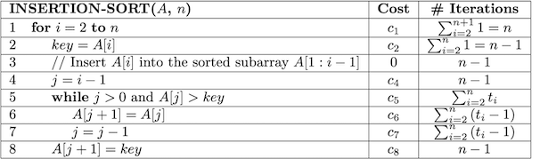
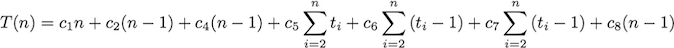

Insertion Sort
==============

All sorting algorithms have the property that given a set of **keys**:

> **Input**: Sequence of numbers \<a1,a2,...,an\>
>
> **Output**: Permutation \<a1',a2',...,an'\> such that a1' ≤ a2' ≤ ... ≤ an'

**Algorithm**

*Insertion Sort* accomplishes this task by looping through each element moving it into place within the preceeding elements in the array. Thus insertion sort *sorts in place*, i.e. the array can be reordered with a *constant* (regardless of input size) amount of extra storage (in this case just a single temp variable for swapping). The pseudocode for the algorithm is:

    INSERTION-SORT(A,n)
    1  for i = 2 to n
    2     key = A[i]
    3     // Insert A[i] into the sorted subarray A[1:i-1]
    4     j = i - 1
    5     while j > 0 and A[j] > key
    6        A[j+1] = A[j]
    7        j = j - 1
    8     A[j+1] = key

**Proof of Correctness**

In order to *prove* the correctness of an algorithm, i.e. that it will work for *any* input set, we construct a *loop invariant* which is a condition that holds for each iteration of the loop (thus the name invariant). Then the proof consists of verifying that the algorithm maintains the loop invariant for three conditions:

> 1.  **Initialization** - the loop invariant holds prior to the first iteration.
> 2.  **Maintenance** - if the loop invariant is true prior to an iteration, then it is still true after the iteration.
> 3.  **Termination** - the loop invariant is true *when the loop terminates*, i.e. after the last iteration thus producing the desired result

Note: This procedure is similar to an inductive proof with a base case and induction step but with an added termination criteria.

The loop invariant for insertion sort can be stated as follows:

    At each step, A[1:i-1] contains the first i-1 elements in SORTED order.

The proof of correctness is then straightforward:

> **Initialization**: Prior to the loop *i* =2 ⇒ *A*[1:*i*-1] = *A*[1] which contains only the *A*[1:*i*-1] elements (of which there is only one) and since there is only a single element they are trivially sorted.
>
> **Maintenance**: The outer **for** loop selects element *A*[*i*] and positions it properly into *A*[1:*i*-1] via the while loop. Since the array *A*[1:*i*-1] began sorted, inserting element A[*i*] into the proper place produces *A*[1:*i*] in sorted order (and contains the first *i* elements).
>
> **Termination**: The loop terminates when *i*= *n*+1 ⇒ *A*[1:*i*-1] = *A*[1:(*n*+1)-1] = *A*[1..*n*] which since the array remains sorted after each iteration gives *A*[1..*n*] is sorted when the loop terminates (and contains *all* the original elements) ⇒ the entire *original* array is sorted.

**Analysis**

For all analysis in this course we assume that the algorithm will be implemented by a *program* run on a *generic computer*, i.e. single processor with random access memory (parallel algorithms are beyond the scope of this course but are extremely important in today's computing environments).

We will define the *input size*, *n*, to typically be the number of elements in the input set (but it could represent the number of bits in a representation or other appropriate enumeration). The *running time* will then be the total number of execution steps as a function of *n* the algorithm takes to complete. We will assume that each line of pseudocode executes in a *constant* amount of time (although that amount may vary from line to line). Thus we multiply the (constant) time each line takes to execute by the number of times the line executes to find a cost per line and then sum the costs of all lines to give the *run time* of the algorithm.

For the while loop in insertion sort, we will define an **indicator** variable *t*i which will essentially "count" the number of times the *while statement* executes for outer loop iteration *i* (which is variable depending on when the while condition terminates the loop). Thus, the total number of times the while statement will execute is given by 

> 

**Note:** The actual statements in the *loop body* (i.e. lines 6 an 7) will execute one *less* time than the while statement *for each* iteration of the outer loop.

*General Run Time*

The run time for insertion sort can then be tabulated as

> 

We then multiply the cost per line with the number of times the line executes and add them up giving

> 

where the *c*i's are the cost of each line (noting that *c*3 = 0 since line 3 is a comment).

*Case 1: Best Case*

The best case for insertion sort is when the input array is already sorted, in which case the while loop body *never* executes. Thus *t*i = 1 for all *i* giving (using Appendix A of CLRS to evaluate the summation)

> 

i.e. the while condition (line 5) executes the same number of times as the other statements in the outer loop. Furthermore, for the statements *inside* the while loop

> 

i.e. the statements in the while body (lines 6 and 7) *never* execute.

Thus the total run time reduces to

> 

which is a *linear* function of *n*.

*Case 2: Worst Case*

The worst case for insertion sort is when the input array is in reverse (decreasing) sorted order, in which case the key will *always* be greater than the preceding elements. Thus the while loop will terminate when *j* = 0 (since *j* is decremented from its initial value of *i-1* each iteration of the while loop) giving the maximum number of times the *while statement* will execute as (again using Appendix A of CLRS)

> 

and the statements inside the loop 

> 

Thus the total run time becomes

> 

which is a *quadratic* function of *n*.

Usually we are only concerned with the *worst case* behavior for several reasons

> -   it gives an upper bound on the run time
> -   it occurs often for certain problems, e.g. searching for a non-existant element
> -   average case is usually close to the worst case, e.g. for insertion sort average case has *w*ji = 1 roughly *half* of the maximum number of iterations for the while loop which still gives quadratic run time (only with different constants)

*Asymptotic Analysis*

As far as the run time dependency on *n*, the actual statement execution times are irrelevant, i.e. the *c*i's can simply be lumped together. Furthermore as *n* becomes large (i.e. asymptotically), the highest order term will ultimately dominate the *growth* of the function (and is known as the measure of the *order of growth*). Finally we ignore the leading constant to give the *asymptotic* run time of insertion sort as Θ (n2).

Note: Asymptotic notation gives the *rate of growth*, i.e. performance, of the run time for *large input sizes* and is **not** a measure of the *particular* run time for a specific input size (which should be done empirically).

