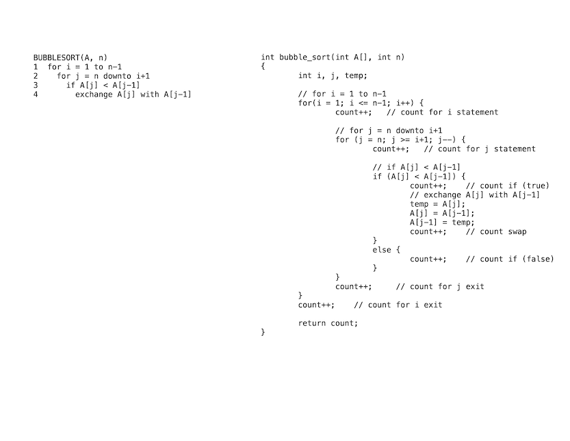
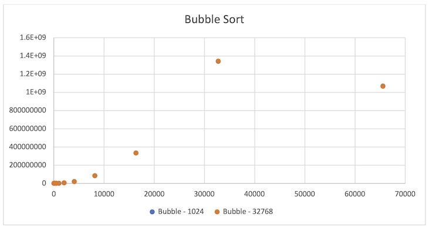

Last class we performed a detailed analysis of insertion sort only to end up discarding most of the work by only keeping the highest order term. We also discarded any constants to describe the *asymptotic growth* of a function based on the *input size*, i.e. for "sufficiently large" values of *n*. Often we would like to empirically measure the actual runtime of an algorithm as a function of input size to get an *estimate* of the *constant* for the highest order term as well as where "sufficiently large" behavior is exhibited.

Implementation
==============

Our first step in benchmarking an algorithm is to implement the pseudocode in a programming language of our choice. The selected language should **not** affect the asymptotic behavior of the algorithm since the analysis is based on the pseudocode operation. The empirical behavior, however, can be affected by programming language and/or system used if our metric is "clock time", i.e. the actual time it takes the algorithm to complete. Thus to make our measurements more consistent across systems, we will instead use a *counter* to simply count each execution of a line of pseudocode, i.e. essentially upper-bounding the execution time of *any* line of code by a constant. So as we implement the pseudocode, we simply increment a counter variable to accumulate the number of statements executed, ignoring the fact that one line of pseudocode may require several lines of actual code depending on the language used. Some general guidelines for properly counting are

> -   Function call statements **DO NOT** increment the counter since their runtime is evaluated by the execution of the function.

> -   Return statement **DO NOT** increment the counter.

> -   Loop statements, i.e. **for** and **while**, will execute *one more* time than the statements in the loop body. Hence a counter can be added both within and after the loop statement as follows

    for (...) {
       count++;
       // Body of loop
    }
    count++;
    
    while (...) {
       count++;
       // Body of loop
    }
    count++;
        
> -   For logical structures, i.e.**if**, **if/else**, **if/else if/ else**, there will need to be counters in *each* branch for the *total* number of conditions to ensure proper counting dependent on which branch executes. Note: if there is no **else** branch, one should be added with simply the count increment in the case when the condition is false to properly count the evaluation of the condition 

    if (...) {
       count++;
       // Body of if
    } else {
       count++;
    }
    
    if (...) {
       count++;
       // Body of if branch
    } else {
       count++;
       // Body of else branch
    }

    if (...) {
       count++;
       // Body of first if branch
    } else if (...) {
       count += 2;
       // Body of second if branch
    } else if (...) {
       count += 3;
       // Body of third if branch
    } else {
       count += however many if conditions there are
       // Body of else branch
    }

The following example shows the pseudocode for bubble sort and the corresponding C implementation with added counter increments

> 

Note that even though the exchange takes *three* lines of C code, we only count the entire sequence *once* as it represents a single line of pseudocode.

Data Collection
===============

Once the implementation is verified to be working, data can be generated for random inputs of various sizes and/or element ranges. For example, a table of output data for the bubble sort implementation where the first column represents the input *size*, i.e. number of elements in the input array, the second column is the average counts when run on arrays with elements in the small range [1->1024], and the third column is the average counts when run on arrays with elements in the large range [1->32768]. Here is a sample csv file containing the data [BubbleData.csv](images/lecture02b/BubbleData.csv) which can be imported into Excel (or other spreadsheet program) 

> n                   |Bubble-1024         |Bubble-32768         |
> --------------------|--------------------|--------------------|
> 16                  |337                 |341                 |
> 32                  |1312                |1325                |
> 64                  |5092                |5164                |
> 128                 |20513               |20598               |
> 256                 |81858               |81455               |
> 512                 |325107              |328957              |
> 1024                |1313036             |1311527             |
> 2048                |5250859             |5235204             |
> 4096                |20923727            |20961492            |
> 8192                |83938403            |83937509            |
> 16384               |335134521           |335295724           |
> 32768               |1339815632          |1343230278          |
> 65536               |1070383972          |1068059893          |

Graphical Evaluation
====================

Plotting the data
-----------------

Using a graphing program, e.g. spreadsheet, the data can be displayed graphically. Since these are empirical data points, they should appear on the graph only as points. Use a *scatter plot* such that *n* is the x axis and the runtime values are the y axis. 

> 

Note that for this example the two data sets are very close, thus the data points overlap. Furthermore, note that the last data point seems to be out of place with the other data. This may indicate an error in the code, or more likely in this case a numerical precision overflow. Thus this bad data point should be removed prior to fitting an asymptotic trend curve.

Adding a trend curve
--------------------

Given that the asymptotic behavior for bubble sort is O(n2), we wish to fit a quadratic of the form **cn**2 to the empirical data points. However, since this asymptotic bound is only valid for *sufficiently large* input sizes, the curve should be biased to fit the larger input size data points more closely than the smaller input sizes. We will accomplish this by simply creating additional column(s) in our table that **calculates** the asymptotic values for a chosen value of **c** from the input size rather than attempt to use a regression curve fit. We can then add this column to the scatter plot displaying it as a *curve* rather than *points* and adjust *c* until the curve fits the larger points well.

> n                   | Bubble - 1024      | Bubble - 32768     |1.3 n^2             |
> --------------------|--------------------|--------------------|--------------------|
> 16                  |337                 |341                 |332.8               |
> 32                  |1312                |1325                |1331.2              |
> 64                  |5092                |5164                |5324.8              |
> 128                 |20513               |20598               |21299.2             |
> 256                 |81858               |81455               |85196.8             |
> 512                 |325107              |328957              |340787.2            |
> 1024                |1313036             |1311527             |1363148.8           |
> 2048                |5250859             |5235204             |5452595.2           |
> 4096                |20923727            |20961492            |21810380.8          |
> 8192                |83938403            |83937509            |87241523.2          |
> 16384               |335134521           |335295724           |348966092.8         |
> 32768               |1339815632          |1343230278          |1395864371          |

> 

Zooming in
----------

From the above plot, we can investigate additional properties by adjusting the x and y axis ranges to see details of the data. For example, we may wish to see how well the asymptotic curve fits small data set sizes where lower order terms may be significant. The key is to adjust *both* ranges such that the plot fills the majority of the plot area. In the figure below, the x axis has been adjusted to the range [0->500] and the y axis to the range [0->160000]. Based on this plot, it appears that bubble sort's O(n2) bound approximates the behavior reasonably well even for small data sets (which looking at the data in the table would also confirm).

 > 
 

