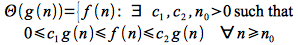
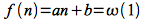
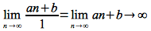

In [lecture 2](lecture02.html) we performed a detailed analysis of insertion sort only to end up discarding most of the work by only keeping the highest order term. In [lecture 2b](lecture2b.html) we implemented psueudocode and added counters to empirically measure the runtime for different input sizes to get an estimate of the *constant* for the highest order term. We intuitively described the *asymptotic growth* of a function based on the *input size*, i.e. for "sufficiently large" values of *n*. Formal mathematical notation can be used to both rigorously define the asymptotic behavior for a particular algorithm as well as serve as a mechanism to *compare* algorithms. Thus typically the asymptotic behavior is used to describe the *efficiency* of an algorithm without requiring computation of the exact run time.

We will want to find either or both an asymptotic *lower bound* and *upper bound* for the growth of our function. The *lower bound* represents the *best case* growth of the algorithm while the *upper bound* represents the *worst case* growth of the algorithm.

O() - ("Big O")
===============

As discussed in the previous lecture, often we are most concerned about the *worst case* behavior of an algorithm. Thus we define an *asymptotic upper bound* (although not necessarily tight) for a function *f(n)* denoted O() as follows: Given two functions *f(n)* and *g(n)*

> 

Thus O() describes how bad our algorithm can grow, i.e. is no worse than. Note: Often it is enough to find a loose upper bound to show that a given algorithm is better than (or at least no worse than) another.

𝛀() - ("Big Omega")
===================

We can similarly define an *asymptotic lower bound* (again not necessarily tight and often not particularly useful) for a function *f(n)* denoted ω() as follows: Given two functions *f(n)* and *g(n)*

> 

Thus ω() describes how good our algorithm can be, i.e. is no better than. For this bound to be meaningful, it is often best to find a tight lower bound.

Θ() - ("Big Theta")
===================

Finally we can define an *asymptotically tight bound* for a function *f(n)* denoted Θ() as follows: Given two functions *f(n)* and *g(n)* both *asymptotically non-negative*

> 

This notation indicates that *g(n)* is both a *lower bound* (best case) and *upper bound* (worst case) for *f(n)*, thus the algorithm has a consistent growth independent of the particular input set.

Theorem
=======

For any two functions *f(n)* and *g(n)*

> 

Intuitively, the theorem simply states that a function is an asymptotically tight bound if and only if it is both an upper and lower bound.

Examples
========

**Example 1**

Show

> 

*Solution*

We need to find *constants* *c*1, *c*2, *n*0\> 0 such that

> 

Dividing through by *n*2 (which is valid since *n*\>0) gives

> 

*Lower Bound*

Consider the *lower bound*, i.e.

> 

If we let *n*0 = 12, then the right hand side becomes

> 

and for *any* *n* \> 12

> 

Hence we can choose *c*1 ≤ 1/4 (e.g. *c*1 = 1/8) and *n*0 = 12 to satisfy the lower bound since

> 

Therefore

> 

Note: **ANY** combination of *c*1 and *n*0 that satisfy the lower bound may be used, but whichever ones are chosen must be **constant** values.

*Upper Bound*

Consider the *upper bound*, i.e.

> 

Again we use a similar procedure to the lower bound but with **the same** *n*0 = 12 (or any *n*0 \> 12 since the lower bound holds for any *n* \> 12), then the left hand side becomes

> 

for *any* *n* \> 12.

Hence we can choose *c*2 ≥ 1/2 (e.g. *c*2 = 1) and *n*0 = 12 to satisfy the upper bound since

> 

Note: Again we may choose **ANY** *c*2 that satisfies the upper bound with the *same* *n*0 as the lower bound, but whichever one is chosen must be a **constant** value.

**Example 2**

Determine if

> 

*Solution*

As before, we need to find *constants* *c*1, *c*2, *n*0\> 0 such that

> 

Dividing through by *n*2 (which is valid since *n*\>0) gives

> 

*Lower Bound*

Consider the *lower bound*, i.e.

> 

Clearly this lower bound can be satisfied for *c*1 = 1 and *n*0 = 1

Therefore

> 

*Upper Bound*

Unfortunately we cannot find any **constant** *c*2 that satisfies

> 

*for all* *n* (much less *n* ≥ *n*0). Therefore

> 

Hence by the theorem

> 

o() - ("Little O")
==================

A weaker (non-asymptotically tight) upper bound that is often useful and easier to determine is defined for two functions *f(n)* and *g(n)* as

> 

This upper bound can be shown by the following limit

> 

For example, it can easily be shown that

> 

since

> 

However

> 

since

> 

ω() - "Little Omega"
====================

A corresponding weaker (non-asymptotically tight) lower bound is defined for two functions *f(n)* and *g(n)* as

> 

This lower bound can also be shown by the following limit

> 

For example, it can easily be shown that

> 

since

> 

However

> 

since

> 

Summary
=======

Intuitively, asymptotic notation can be thought of as "relational operators" for functions similar to the corresponding relational operators for values

> = ⇒ Θ()
>
> ≤ ⇒ O()
>
> ≥ ⇒ Ω()
>
> \< ⇒ o()
>
> \> ⇒ ω()

Review properties of exponentials (pg. 55 of CLRS), logarithms (pg. 56 of CLRS), and summations (Appendix A of CLRS).

