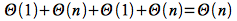
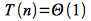
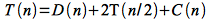
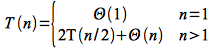
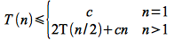
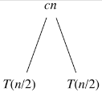
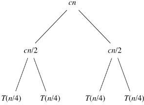
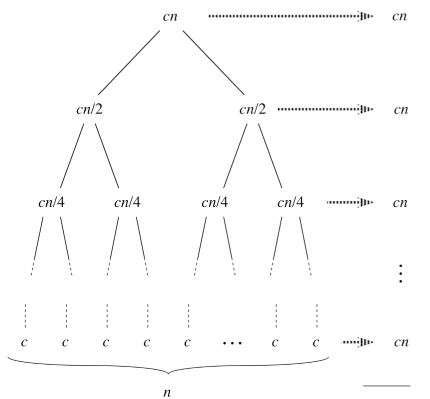
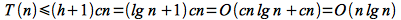

An approach used to solve many computational problems is *divide and conquer*. The premise is to repeatedly subdivide a problem up into smaller (i.e. simpler) versions of the original problem until the subproblems can be easily solved. Then the partial solutions are combined together to give the solution to the original problem. If the subproblems can be formulated identical to the original one, then a *recursive* procedure can be implemented to perform the subdivision.

Divide and Conquer Scheme
=========================

There are three parts to a divide and conquer strategy:

> -   **DIVIDE** - break the problem up (often recursively) into similar (but simpler) subproblems until a stopping criteria is reached
> -   **CONQUER** - solve all subproblems (sometimes trivially)
> -   **COMBINE** - assemble the results of the subproblems to produce the solution to the original problem.

Merge Sort
==========

One application of the divide and conquer approach to sorting is an algorithm known as *merge sort*. The three parts for merge sort are

> -   DIVIDE - repeatedly break the array into two halves until every subarray contains only a *single* element
> -   CONQUER - sort each subarray, which since they each contain a single element is trivially accomplished
> -   COMBINE - use the MERGE() routine to put the *sorted* subarrays together

The pseudocode implementation for merge sort is

    MERGE-SORT(A,p,r)
    1  if p < r
    2     q = (p+r)/2
    3     MERGE-SORT(A,p,q)
    4     MERGE-SORT(A,q+1,r)
    5     MERGE(A,p,q,r)

    MERGE(A,p,q,r)
    1  n1 = q - p + 1
    2  n2 = r - q
    3  let L[1..n1+1] and R[1..n2+1] be new arrays
    4  for i = 1 to n1
    5     L[i] = A[p+i-1]
    6  for j = 1 to n2
    7     R[j] = A[q+j]
    8  L[n1+1] = INF
    9  R[n1+1] = INF
    10 i = 1
    11 j = 1
    12 for k = p to r
    13    if L[i] <= R[j]
    14       A[k] = L[i]
    15       i = i + 1
    16    else
    17       A[k] = R[j]
    18       j = j + 1

**Analysis**

First we will examine the run time of MERGE() and then analyze the recursive MERGE-SORT() routine.

*MERGE()*

For MERGE()

> Input: *A[p..q]* and *A[q+1..r]* are sorted
>
> Output: *A[p..r]* is sorted
>
> Θ(1) Lines 1-3 - compute two values and allocate memory
>
> Θ(n) Lines 4-7 - copy elements from *A[]* into *L[]* and *R[]*
>
> Θ(1) Lines 8-11 - add sentinal values and initialize loop counters
>
> Θ(n) Lines 12-18 - loop from *p* to *r* placing either *L[i]* or *R[j]* into *A[k]*

Thus the run time for MERGE()

> 

i.e. MERGE() is a *linear* algorithm.

*MERGE-SORT()*

MERGE-SORT() recursively divides *A[]* in half (using a constant time computation for *q*) calling MERGE-SORT() on each half until *p* ≥ *r* (i.e. until each subarray has a single element). At this point each subproblem is trivially solved in constant time. Thus for *n=1* (i.e. the *base case* for the recursion)

> 

Otherwise the problem is divided into two subproblems of length *n/2* which are solved using MERGE-SORT() and then combined using MERGE(). Thus the recursion can be expressed as

> 

where *D(n)* is the time to *divide* the arrays (which takes Θ(1) time), *T(n/2)* is the time to *conquer* each half, and *C(n)* is the time to *combine* using MERGE() (which from the previous analysis takes Θ(n) time).

Hence we can write the recursive equation for MERGE-SORT() as

> 

If we let *c* be an upper bound on Θ(1) and the constant in Θ(n), then we can write the recursion as

> 

Note: we have change the relational operator from = to ≤ since we have replaced (unknown) values on the right-hand side with *larger* constants which makes the right-hand side *bigger* than the original one.

We must now *solve* this *recursive* equation to find *T(n)* (i.e. the run time of MERGE-SORT()) - which is **NOT** done algebraically. In subsequent lectures we will see a technique for solving recursive equations of a particular form, but for now we will solve this equation by constructing a *recursive tree* of run times. Then we will simply sum across each level of the tree to give the run time per recursive level and then sum up the run time for all levels to give the final run time of the algorithm.

The initial recursive equation for *T(n)* can be drawn with the combine cost as the root and the recursive pieces as the leaves as

> 

Expanding the recursive terms using *n/2* gives

> 

Finally we continue to expand the recursive terms until *n*=1 (giving *n* leaves at the last level).

> 

Note that at each subsequent recursive level *i* the recursive term becomes *n/2*i and the recursion will terminate when *n/2*h = 1 ⇒ *h* = lg(*n*) where lg represents log2. Thus there will be *h*+1 levels (*i* = 0 .. *h*) with each level having a run time of *cn*. Hence the total run time of the algorithm will be bounded by

> 

We will see later that the bound is actually asymptotically tight and thus the run time of merge sort is Θ(*n* lg *n*).

