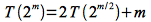

We derived the run time for merge sort in lecture 4 by constructing a *recursion tree* and then adding up the run times for each level of the recursion. The recursive equation for merge sort, however, fits into the form required by the master theorem and thus could have been solved by inspection. However when a recursive equation does not satisfy the form for the master theorem, an alternative technique known as the *substitution method* is required to find the solution (which may use the recursion tree technique as an intermediate step). This technique involves proving (similar to proof by induction) that a "guess" solves the recursive equation. This "guess" often comes from experience from other similar problems or through a recursion tree.

Recursion Trees
===============

In order to formulate a good "guess" at a solution to use in the substitution method, a *recursion tree* can often be constructed to find an approximation to the run time. Similar to the one constructed for merge sort, the procedure consists of:

> -   Construct the tree based on the recurrence
> -   Calculate the run time for each recursive level
> -   Sum up all levels to compute the total run time

**Example**

Find a "guess" for the recursive equation (which could be checked with the master theorem)

> 

Again we will assume a bound for the asymptotic term as Θ(*n*2) = *c n*2 and construct the tree as follows

> 

Expanding the next level gives

> 

At each subsequent level there are n/4i elements, so we continue expanding until n/4h = 1 ⇒ *h* = log4 *n* giving *h* + 1 = log4 *n* + 1 levels of recursion as shown below.

> 

It can be seen from the diagram that each level has 3i terms of *c* (*n*/4i)2. Hence the run time for each level is

> 

The last level (where *i* = log4 *n* and *T*(1) = c) will have

> 

Thus summing up the run time for all the levels gives

> 

Note: This strictly gives an *upper bound* which can be used as a starting "guess" for the substitution method.

Substitution Method
===================

While the recursion tree method provides an *approximate* bound, to mathematically *prove* that the bound is correct requires the substitution method. This method essentially uses a proof technique similar to induction where the bound is verified for the recursive equation and a base case is found that holds for the recursion. To accomplish the proof, the bound is *assumed* to hold for *T(n)* and then is *substituted* into the recursive equation to demonstrate that the assumption is correct by deriving **EXACTLY** the same bound as the assumption. The technique is best demonstrated by example.

**Example** (to verify the recursive tree "guess" for the previous example)

Show that the solution for

> 

is *T(n)* = O(*n*2).

*Assume* the solution holds so that by the definition of O()

> 

for some *c* \> 0. Substituting the assumption into the *T(n/4)* term gives

> 

We must now manipulate the right side until it is **exactly** of the form *cn*2 as follows

> 

Now we need to verify a base case that holds for the recursion. Assuming *T(0)* = 0, for *n* = 1

> 

Evaluating the assumption for the solution gives

> 

which holds for *c* ≥ *k* (which is satisfied by our choice of *c* above to verify the recursion). The base cases for *n* = 2,3 (since *T(2/4)* = *T(3/4)* = *T(0)*) can also be easily verified and hence we have *proven* the assumed solution *T(n)* = O(*n*2) is correct for *c* ≥ (16/13)*k* and *n* ≥ 1. Note that by inspection we see *T(n)* = Ω(*n*2 ) (since the combine term is at least that big) and thus *T(n)* = Θ(*n*2).

Note: Unlike inductive proofs where the induction must hold *for all* *n*, recursive proofs for asymptotic bounds only need to hold for *n* ≥ *n*0. Hence we only need to find *a* value of *n* (not *necessarily* *n* = 1) for which the base case is satisfied.

Often our guess is "too weak" to show the induction, however we can sometimes include a lower order term (which does not change the asymptotic bound) in order to prove the solution.

**Example**

Show that the solution for

> 

is *T(n)* = O(*n*).

*Assume* the solution holds so that by the definition of O()

> 

for some *c* \> 0. Substituting the assumption into the *T(n/2)* term gives

> 

However we needed to show *T(n)* ≤ *cn* **NOT** *cn* + 1 (even though 1 seems negligible for large *n*)! Instead we try another "guess" which still satisfies the asymptotic bound

> 

Now substituting the new assumption into the *T(n/2)* term gives

> 

After verifying boundary conditions, we have proven that *T(n)* = O(*n*).

Lastly we can sometimes perform a substitution of variables to transform a recursive equation into a form that we can more easily solve.

**Example**

Find the solution to the following recursive equation

> 

Let *m* = lg *n* ⇒ *n* = 2m. Then the recursive equation can be rewritten as

> 

Then let *S(m)* = *T(*2m*)* giving

> 

Which has solution *S(m)* = O(*m* lg *m*) (i.e. merge sort). Thus replacing *m* = lg *n* gives *T(n)* = O((lg *n*) lg (lg *n*)).

