The first sort we looked at was insertion sort which had (average) run time O(*n*2) but required a constant (with respect to *n*) amount of additional storage. Mergesort on the other hand, had O(*n* lg *n*) run time, but the amount of memory required growed with *n* (since at each level of recursion new partial arrays are allocated). *Heapsort* is a sorting algorithm that maintains the O(*n* lg *n*) run time (like mergesort) but operates *in place* (like insertion sort). This sorting algorithm is based on a data structure known as a *heap* (which is also one way to implement a *priority queue*).

Heaps
=====

A *heap* is simply an array viewed as a nearly complete *binary tree* (meaning a subsequent level is not started until the previous level is completely filled). For example, the array

> 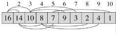

can be viewed as heap

> 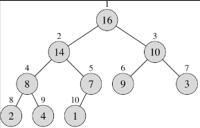

**Heap values**

We define the following values for an array *A* viewed as a heap

> -   *A.length* - size of the array
> -   *A.heapsize* - number of elements in the heap (note *A.heapsize* ≤ *A.length*)
> -   *height* - height of the heap binary tree = Θ(lg *n*)

**Heap operations**

For heaps we assume the following operations

> -   *A[i]* - value at node (element) *i*
> -   LEFT(*i*) - index of left child node = 2*i*
> -   RIGHT(*i*) - index of right child node = 2*i* + 1
> -   PARENT(*i*) - index of parent node = *i* / 2

Note: LEFT() and RIGHT() can be efficiently computed using bitwise shift and set operations.

**Max-heaps**

We define a **max-heap** as a heap that satisfies the property that *A[PARENT(i)]* ≥ *A[i]* for all *i*, i.e. the value of every parent is greater than *both* children. Thus for a max-heap, the largest value is stored at the *root*.

**Min-heaps**

Similarly we define a **min-heap** as a heap that satisfies the property that *A[PARENT(i)]* ≤ *A[i]* for all *i*, i.e. the value of every parent is less than *both* children. Thus for a min-heap, the smallest value is stored at the *root*.

**Creating a max-heap**

Building a max-heap from an array involves two routines

> -   MAX-HEAPIFY(A,i) - maintains the max-heap property by assuming that the branches of the binary tree rooted at the children of node *i* are max-heaps but that node *i* may be smaller than either (or both) of its children. Thus it *percolates* node *i* down through the max-heap such that the branch starting at node *i* is a max-heap.
> -   BUILD-MAX-HEAP(A) - creates a max-heap from an array by calling MAX\_HEAPIFY() from the "bottom up" of the array (such that at each step the bottom branches are max-heaps).

*MAX-HEAPIFY()*

The MAX-HEAPIFY() routine swaps a parent node with the largest child node recursively until it ends up in the correct location in the heap. The pseudocode for the procedure is

    MAX-HEAPIFY(A,i)
    1  l = LEFT(i)
    2  r = RIGHT(i)
    3  if l <= A.heapsize and A[l] > A[i]
    4     largest = l
    5  else
    6     largest = i
    7  if r <= A.heapsize and A[r] > A[largest]
    8     largest = r
    9  if largest != i
    10    exchange A[i] with A[largest]
    11    MAX-HEAPIFY(A,largest)

Lines 1-10 take constant time (i.e. are O(1)) so the worst case run time will be when the recursion occurs the maximal number of times. Since the recursion selects one of the two children to recurse down (i.e. *largest*), the worst case will happen when the most nodes are *retained* in the selected branch as shown in the following figure

> 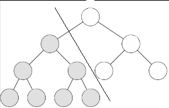

Since a heap is a nearly complete binary tree, for a given level *i* (where the root node is *i* = 0) there will be 2i nodes at that level. If the last level *k* is only half full (to retain the most nodes), there will be 2k/2 nodes in this level. For the first *k*-1 levels there will be a total of

> 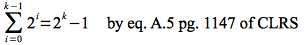

Therefore the total number of nodes in the heap can be written as

> 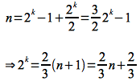

Thus in the worst case half of the nodes in the first *k*-1 levels (minus the root) will be retained in addition to *all* the ones in the *k*th level giving

> 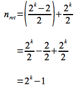

Substituting 2k = (2/3) n + 2/3 from above gives

> 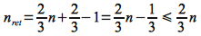

Hence two-thirds of the nodes are retained in the worst case giving the recursive equation for MAX-HEAPIFY()

> 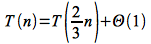

This recursive equation can be solved by inspection using *Case 2* of the master theorem as

> 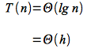

where *h* = lg *n* is the maximum number of levels the node can traverse in the binary tree.

*BUILD-MAX-HEAP()*

Using MAX-HEAPIFY() we can construct a max-heap by starting with the last node that has children (which occurs at *A.length*/2) and iterating back to the root calling MAX-HEAPIFY() for each node which ensures that the max-heap property will be maintained at each step for all evaluated nodes. The pseudocode for the routine is

    BUILD-MAX-HEAP(A)
    1  A.heapsize = A.length
    2  for i = A.length/2 downto 1
    3     MAX-HEAPIFY(A,i)

Thus since there are O(*n*) nodes with O(lg *n*) time for MAX-HEAPIFY() an upper bound for the total run time of BUILD-MAX-HEAP is

> 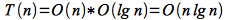

However, the run time for MAX-HEAPIFY() is really O(*h*) with a majority of the nodes having *h* ≤ lg *n* (i.e. most of the nodes are at the *bottom* of the tree with only the root having true worst case behavior). Thus a node at level *i* (of which there are 2i) will have *h* = lg *n* - i. Hence a better upper bound for the running time is given by

> 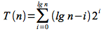

If we let *k* = lg *n* - *i* ( ⇒ *i* = lg *n* - *k*) then we can rewrite and simplify the summation as

> 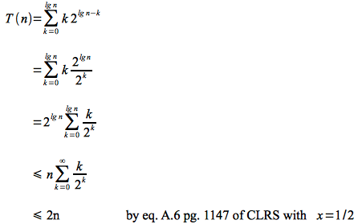

Hence a better upper bound for BUILD-MAX-HEAP is O(*n*), i.e. we can *build* a max (or min) heap from an array in *linear* time.

Heapsort
========

Once we have created a max-heap, to sort the elements we simply

> -   swap the root with the last node *in the heap* (since the root is guaranteed to be the maximum *remaining* element) and remove it from the heap (note it will still be in the array but in sorted order at the back of the array)
> -   rebuild the max-heap by calling MAX-HEAPIFY on the root
> -   repeat the procedure until there are only two nodes remaining in the heap

The pseudocode for heapsort is

    HEAPSORT(A)
    1  BUILD-MAX-HEAP(A)
    2  for i = A.length downto 2
    3     exchange A[1] with A[i]
    4     A.heapsize = A.heapsize - 1
    5     MAX-HEAPIFY(A,1)

Thus there is one call to BUILD-MAX-HEAP() which is O(*n*) and *n*-1 calls to MAX-HEAPIFY which is O(lg *n*) giving a run time for HEAPSORT() of

> 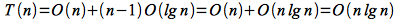

Since all the operations are performed by simply exchanging array elements, heapsort works *in place* in O(*n* lg *n*) time.

Priority Queues
===============

One nice application of heaps is as a way to implement a *priority queue* (a data structure where the elements are maintained in order based on a priority value). Priority queues occur frequently in OS task scheduling so that more important tasks get priority for execution on the CPU. The priority queue will require operations to add new elements, remove the highest priority element, or adjust the priority of elements in the queue (updating the ordering accordingly). Thus a priority queue can be created (using BUILD-MAX-HEAP() and maintained efficiently as a max (or min depending on the application) heap. The priority queue operations are

> -   HEAP-MAXIMUM(A) - returns the largest (highest priority) element which for a max-heap is the root - O(1)
> -   HEAP-EXTRACT-MAX(A) - removes the root by swapping it with the last element in the queue (heap), decrements the size of the queue (heap), and calls MAX-HEAPIFY() on the new root (similar to a single step of heapsort) - O(lg *n*)
> -   HEAP-INCREASE-KEY(A,i,key) - modify the value of node *i* to *key* and then "bubble" it up through parent nodes (maintaining the max-heap property) - O(lg *n*) since at worst it will need to traverse up the entire tree lg *n* levels
> -   MAX-HEAP-INSERT(A, key) - add a new element by increasing the size of the queue (heap), setting the value of the new element to -∞, and calling HEAP-INCREASE-KEY() with the new value - O(lg *n*) since it takes the same time as HEAP-INCREASE-KEY()

Thus a priority queue can be created in *linear* time and maintained in *lg* time using a heap.

