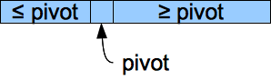
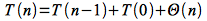
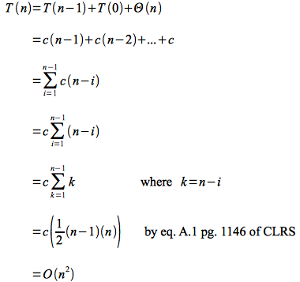
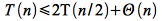

One of the most commonly used sorting algorithms is *quicksort*. While the worst case run time of quicksort is O(*n*2), the average run time is O(*n* lg *n*) but typically with a smaller constant than merge or heap sorts. Like heapsort, quicksort also operates in place.

Quicksort
=========

Quicksort is a divide-and-conquer sorting routine (similar to merge sort) where a *pivot* element is selected to *partition* the array into two (possibly unequal or even empty) subarrays positioning the pivot element in the proper sorted location. The algorithm then recurses on both subarrays performing the same procedure. Since each step places the pivot element into its final location, there is no combine step needed. Thus the pseudocode for the quicksort algorithm is

    QUICKSORT(A,p,r)
    1  if p < r
    2     q = PARTITION(A,p,r)
    3     QUICKSORT(A,p,q-1)
    4     QUICKSORT(A,q+1,r)

**Partitioning**

The key to the quicksort routine is selecting a *pivot* element and then moving all values *less* than the pivot to the front of the subarray, all the values *greater* than the pivot to the back of the subarray, and then inserting the pivot element between the two parts (which is its *sorted* position). One simple way to select the pivot element is to simply take the *last* element in the subarray. After moving smaller elements to the front and inserting the pivot into its correct location, the subarray will have the following structure

> 

Note that while the pivot element is in the correct final location, the two other pieces are *not* sorted.

The pseudocode for the partitioning routine is

    PARTITION(A,p,r)
    1  x = A[r]
    2  i = p - 1
    3  for j = p to r-1
    4     if A[j] <= x
    5        i = i + 1
    6        exchange A[i] with A[j]
    7  exchange A[i+1] with A[r]
    8  return i+1

Since the loop runs from *p* to *r-1* (which for the initial call is 1 and *n-1*) and all other statements have constant run time, the total run time for PARTITION() is O(*n*).

**Analysis**

Unlike merge sort where the array was split in half at each step, the partition sizes for quicksort depend on the relationship of the elements to the pivot. Thus we will perform an analysis on the worst, best, and average cases.

*Worst Case*

The worst case (unlike insertion sort) occurs when the array is *already sorted*. In this case the pivot element is *always* the largest element at each step and thus the array is partitioned into subarrays of size *n-1* and 0. This gives the following recursive equation

> 

Expanding this recursive equation (which cannot be solved using the master theorem) simply gives an arithmetic series

> 

Thus quicksort has *worst case* run time O(*n*2) which is for a *sorted* array (where insertion sort has run time O(*n*)). One way to avoid this issue is to simply preprocess the array to verify it is not sorted which takes O(*n*) time (thus will not affect the asymptotic run time of quicksort).

*Best Case*

The best case occurs when all the partitions are *balanced*, i.e. are equal of size *n*/2. This gives the recursive equation

> 

This equation can be solved with the master theorem (or recall this is the same recursive equation as merge sort) to give a *best case* run time of O(*n* lg *n*). Thus it appears that even in the best case, quicksort is asymptotically no better than either mergesort or heapsort.

*Average Case*

In the average case the partitions will not be perfectly balanced, but will still produce a recursion tree that has no more than *cn* cost for lg *n* (actually logb *n* where *b* is the same constant as in the master theorem) levels giving an average run time also of O(*n* lg *n*). The more unbalanced the partitions, the larger the hidden constant (and higher the actual run time). However as long as there are some reasonably balanced splits, the cost of the bad splits is partially offset by the good splits to give an often empirically faster algorithm than merge or heap sort. Alternatively, we can try to produce a "good mix" of partitioning by randomizing the input sequence prior to sorting (also reducing the chance of the worst case) or by selecting a random pivot element (and swaping it with the last element in the subarray).

