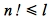
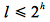
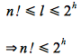
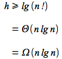
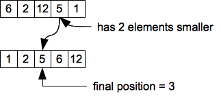
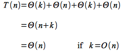
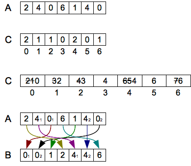

So far we have seen four sorting algorithms of which three had a run time of O(*n* lg *n*). The question that we always ask is - "Is there a better (faster) way to do this?" It turns out in the case of sorting that the answer is **NO** in general. However under certain restrictions we *can* do better using *counting sort* to sort in *linear* time.

Comparison Sorts
================

It can be *proven* that **ALL** comparison sorts (regardless of implementation) are worst case Ω(*n* lg *n*) - a rather bold statement to say the least!

**Proof**

Sorting is essentially a procedure that takes a given input array and produces a *permutation* of this array such that the elements are in increasing/decreasing order. Thus for *n* elements there will be *n*! permutations, *all* of which must be able for the algorithm to produce (otherwise there would be certain input arrays that could not be sorted).

If the sort uses comparisons between elements to perform the sorting, we can construct a binary decision tree (since each comparison will return true or false) such that the leaves of the tree are all *n*! permutations.

Since all of the permutations must be reachable by some path through the tree, the worst case will be the *longest* path. Hence a lower bound is the height of the tree. For *l* leaves and *n*! permutations

> 

A binary tree of height *h* has at most 2h leaves, thus

> 

Therefore combining the above inequalities gives

> 

Taking the lg() of both sides and eq. 3.19 pg. 58 of CLRS

> 

Thus *any* comparison sort will be worst case at least Ω(*n* lg *n*). This proof also means that mergesort and heapsort are *asymptotically optimal* since they are also O(*n* lg *n*) worst case.

Thus the only way to sort faster is to **not** use comparisons!

Counting Sort
=============

Since sorting by definition is deriving an *ordering* for elements, how can the order be determined without comparing the elements? If the elements are *integers* in the range 0 to *k*, the answer comes in using the elements not only as *values* but also as *indicies* into an array and *counting*. If *k* = O(*n*) then the sort will run in Θ(*n*), i.e. *linear* time. This sort will also require two additional arrays *B[1..n]* which will contain the final sorted array and *C[0..k]* which is needed for working storage.

The idea is that an elements final position is equal to the number of elements less than itself plus 1. For example consider the following array

> 

We see that the value 5 has two elements less that itself, thus it will end up in position 3.

The key is that we can determine these positions *without comparisons*, hence the Ω(*n* lg *n*) bound does not apply!

The pseudocode for the algorithm is

    COUNTING-SORT(A,B,k)
    1  let C[0..k] be a new array
    2  for i = 0 to k
    3     C[i] = 0
    4  for j = 1 to A.length
    5     C[A[j]] = C[A[j]] + 1
    6  // C[i] now contains the number of elements equal to i
    7  for i = 1 to k
    8     C[i] = C[i] + C[i-1]
    9  // C[i] now contains the number of elements less than or equal to i
    10 for j = A.length downto 1
    11    B[C[A[j]]] = A[j]
    12    C[A[j]] = C[A[j]] - 1

Intuitively the algorithm

> -   Initialize *C[]* to 0 - Θ(*k*)
> -   Loop through the input array incrementing corresponding elements of *C[]* (i.e. count how many of each value are present) - Θ(*n*)
> -   Loop through *C[]* to *accumulate* the total number of elements less than each value - Θ(*k*)
> -   Loop *backwards* through *A[]* placing each element in its correct final position in *B[]* (based on the values stored in *C[]*) and decrement *C[]* accordingly (to deal with repeated values in the input array) - Θ(*n*)

Thus the run time is

> 

The algorithm uses the values as *indices* rather than in comparisons which allows for the *linear* run time - but with the restriction that the input array elements are *non-negative bounded integers*.

One other property of counting sort is that it is a *stable sort*. This means that repeated values in the input array will remain in the same *relative order* in the output (sorted) array. This propery is often important as commonly the values represent *keys* in a database that index additional data in the record. Thus a stable sort will keep records with the same key that come first in the database remaining first after sorting.

**Example**

For the given input array *A[]* (note that *k* = 6, i.e. the largest value in the array) the first and second *C[]* arrays are shown along with the reordering (which takes place from the *end* of *A[]* forward with the values subscripted to demonstrate the stable sorting property).

> 

Radix Sort
==========

An interesting variation on counting sort is known as *radix sort* which is useful when *k* becomes large. The sort operates by using a stable sort to sort the elements *digitwise* starting with the *least significant digit*. The number of digits *d* of a number *n* is given by *d* = logb *n* (where the base of the logarithm *b* is the *radix* of the digits, i.e. the number of values each digit can have - e.g. 10 for decimal). The pseudocode for the algorithm is

    RADIX-SORT(A,d)
    1  for i = 1 to d
    2     use a stable sort to sort array A[] on digit i

It can be shown that if counting sort is used for the stable sort, the run time of radix sort is Θ(*d*(*n* + *k*)) where *d* is the number of digits and *k* is the range of each digit. Radix sort is especially useful when we need to sort a large number of values that have a *constant* (usually relatively small) number of digits as it will then only require O(*n*) extra space.

