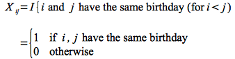
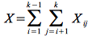

Up to this point we have been considering algorithms *deterministically*, i.e. best and worst case behavior. We have occasionally looked at average case behavior, but assumed that all inputs are equally likely to occur. Sometimes the exact inputs for an algorithm are unknown, but an input distribution can be approximated to provide the *probability* that certain inputs will occur. Using input probability distributions to analyze algorithms is known as *amortized analysis* and is beyond the scope of this course. However we will investigate a useful technique for probabilistic analysis known as *indicator random variables* in the context of two common counting problems.

Hiring Problem
==============

Consider that you are in charge of hiring and are looking to fill an office position. The prospective candidates are sent by an employment agency and are assumed to be numbered 1..*n*. Your hiring strategy is to interview each candidate and hire them if they are better qualified than the current employee (a rather cut throat approach).

The cost to *interview* a candidate is *c*1, and the cost to *hire* a candidate is *c*2 (it is assumed that *c*2 \>\> *c*1).

The question the CFO of the company wants answered is - What is the *expected cost* of this hiring strategy?

We know that we will have to interview all the candidates for a total *interview* cost *c*1*n*, and if we only hire *m* of the candidates there will be a total *hiring* cost of *c*2*m*. Thus the total cost will be O(*c*1*n* + *c*2*m*). Since the *interview* cost is fixed for all strategies, we only focus on the *hiring* cost for the analysis. Thus the question becomes - what fraction of the *n* candidates are hired *on average*.

**Worst Case**

The worst case is if the candidates arrive in increasing order of skill in which case *all* of them would be hired (and each previous one *fired*) giving a hiring cost of O(*c*2*n*).

**Best Case**

The best case is if the first candidate is the best one in which case they are the only one that is hired for a total hiring cost of O(*c*2).

**Average Case**

A first intuitive guess for the average case would be O(*c*2(*n*/2)), i.e. half of the candidates are hired. However the actual average case will depend on the distribution of the *n*! possible permutations. In order to mitigate the possibility of the employment agency maliciously sending the candidates in order of increasing skill (so that they get the most money), we will take control by *randomizing* the inputs *before* processing (which could be done by providing them the random order to send candidates). Thus the worst case occurs only if *we* are unlucky and unfortunately select (by random chance) the poor permutation.

Each input sequence will have an individual hiring cost, but since the sequence itself is a *random variable* the average hiring cost will be the *expected value* of the hiring costs. Recall from discrete math or probability and statistics that the *expected value* of a random variable **X** that can take on *n* different values {*x*1,*x*2,...,*x*n} that occur with probabilities {*p*1,*p*2,...,*p*n} (note that *p*1 + *p*2 + ... + *p*n = 1) is given by the formula

> 

Thus if we assume that each of the *n*! permutations is equally likely to occur (with probability 1/*n*!), we could compute the expected value using the formula by simply computing the hiring cost for *each* permutation. Unfortunately this is not feasible for even small values of *n*. Thus we will employ another technique to find the expected value known as *indicator random variables*.

**Indicator Random Variables**

The technique of *indicator random variables* is based upon the concept of an *event* either *occuring* or *not occuring*. Thus for an event **A** (which is a random event), we will define an *indicator variable* as

> 

Thus **I** simply *indicates* whether or not a random event occurs. For example, consider the event for a coin toss being that the result is heads. The indicator random variable would then be 1 (true) if the coin lands on heads and 0 (false) otherwise (which in this case would be landing on tails). Since **A** is a random event, **I** is a random value, and we will define a random variable

> 

We can then easily find the *expected value* of **X**A as

> 

Thus the *expected value* of an *indicator random variable* is simply the *probability* that the *event occurs*.

*Hiring Problem*

Applying indicator random variables to the hiring problem, we will define the event **A** as the event that "candidate *i* is hired". Thus we can define the indicator random variable for this event as

> 

The expected value of this random variable is

> 

One way to see this is to consider that candidate *i* is hired *only if* they are the *most qualified* of the first *i* candidates. Thus this is equivalent to given a sequence of distinct values, that the *last* value is the *largest*. However the probability of this happening is equivalent to asking what is the probability that the last slot has a particular value (in this case the largest) out of *i* possible values which clearly has probability 1/*i*.

Thus the total number of hires **X** for a permutation can be written as

> 

which is simply a sum of the individual hires. **X** will be a random variable dependent on which particular permutation is selected. Thus the *average* number of hires will be equal to the *expected value* of this random variable which can be computed (using the fact that expected value is a *linear operator*) as

> 

Thus *on average* only lg *n* candidates (quite a bit fewer than *n*/2) will be hired giving an expected hiring cost of O(*c*2 lg *n*).

Birthday Paradox
================

Another interesting problem that can be solved with indicator random variables is the well known *birthday paradox* problem. The problem is - "How many people do you need in a room to have at least 2 with the same birthday?" (We assume that birthdays are distributed equally among all days of the year and neglect leap years.)

If there are *k* people in the room, we will define an indicator random variable **X**ij for the event that person *i* and person *j* have the same birthday as

> 

Then the total pairs that have common birthdays **X** is simply

> 

We compute the expected value of **X** similarly to before

> 

Now we note that the probability that *i* and *j* have the same birthday is 1/*n* where *n* is the number of days in the year. This is easily seen because person *i* will have birthday on a fixed day *r*, so the problem reduces to determining the probability of selecting a particular value (*r*) from *n* possible numbers at random. This probability is clearly 1/*n*.

Thus the expected value reduces to

> 

So if we wish to have E[**X**] = 1 ⇒ *k(k-1)* ≥ 2*n* we can expect at least one pair of people to have the same birthday. Solving for *k* gives

> 

Setting *n* = 365 gives *k* ≈ 28.

