While arrays are a common data structure used in many programs when the *keys* are in a relatively small integer range, often there is a need to efficiently index non-integer keys using a data structure known as a *hash table*. A hash table uses a *hashing function* to *compute* an index from a key which is used to locate the data in the hash table.

Direct Addressing (Arrays)
==========================

When the *universe* of keys *U* is a small finite set of *non-negative* values, the key itself can be used as an index to the data. This mechanism is known as *direct addressing* and is the principle way an array operates. As long as each record has a unique key, the data can be referenced directly through the key used as an index into an array. Elements with identical keys can be stored in the *table* *T* by *chaining* the elements via a linked list at each array location as shown below.

> 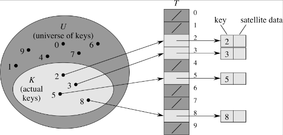

Indexing is an O(1) operation (essentially simply an array reference). The limitation is that the table (array) must have the same number of slots at there are keys in the universe.

Hash Tables
===========

As \|*U*\| becomes large, the storage requirements for *T* become prohibative, especially since typically only a very small subset of the keys are used. Thus an efficient way to store the data is using a limited size table *T* with *m* slots (thus *T* can be implemented as an array with indices *T*[0..m-1]). The index in the table is computed using a *hashing function h* which maps *h*: *U* → {0,1,...,m-1}, i.e. key *k* hashes to slot *h*(*k*).

> 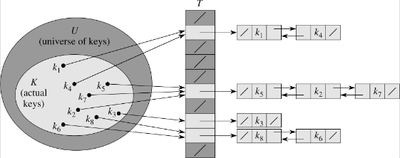

Since m ≪ \|*U*\| there are several desirable properties for a good hashing function *h*(*k*)

> -   *h*(*k*) should produce (relatively) unique values for distinct *k*'s, i.e. the hashing function should attempt to use all to the slots with equal frequency
> -   *h*(*k*) should appear "random", i.e. "close" keys should map to "far away" hash values

By the pigeonhole principle, since there are (significantly) more keys than slots, multiple keys will hash to the same slot known as *collisions*. As with direct addressing, collisions can be resolved through *chaining* which creates a linked list at each hash slot adding elements that hash to the same slot at the front of the list. Thus a hash table will usually include a method to search through the elements stored at a hash value's chain.

**Chain Operations**

> INSERT(*T*, *x*) - place new element *x* at the head of list *h*(*k*) - O(1) assuming element is not in list, otherwise need to search list
>
> DELETE(*T*, *x*) - delete element *x* from list at *T*(*h*[*x.key*]) - O(1) since *x* would contain pointers to the *next* and *prev* elements in the list
>
> SEARCH(*T*, *k*) - find element with key *k* in *T*(*h*(*k*)) - O() depends on the length of the lists (certainly upper bounded by O(*n*))

*Chain Search*

In order to determine the run time of searching the chains in a hash table, we will define a parameter called the *load factor*

> 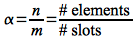

which represents the *average* number of elements per slot.

Thus the *worst case* will be when all the keys hash to a single slot ⇒ the table is simply a linked list with search time O(*n*).

The *average case*, however, assumes *simple uniform hashing*, i.e. each key is equally likely to hash to any slot. For this case we will let *n*j be the number of elements that hash to slot *T*[*j*] where 0 ≤ *j* ≤ *m*-1. Furthermore we know that *n* = *n*0 + *n*1 + ... + *n*m-1, i.e. every element must hash to some slot. Lastly since we assume simple uniform hashing, E(*n*j) = α, i.e. the expected number of elements in a slot is equal to the load factor. Thus the question is "How many elements do we need to *search* on average?" (assuming it takes O(1) to compute *h*(*k*)) To answer this question we need to consider the two cases depending on whether or not the element is in the list.

> **Case 1**: Element is *not* in the list
>
> Since the element was equally likely to hash to any of the *m* slots which all have expected length E(*n*h(k)) = α and we must search *all* the elements in the list ⇒ Θ(1+α)
>
> **Case 2**: Element *is* in the list
>
> Assuming the element *x* is equally likely to be in *any* of the *n* elements currently stored in *T*, the number of elements searched will be 1 more than the number of elements added *after* *x* that hashed to the same slot (since we add collisions to the *beginning* of the list). Thus we want to find the average over all *x* of
>
> > 1 + E(\# elements added *after* *x*)
>
> We can utilize indicator random variables by defining for each *x*i an associated indicator random variable
>
> 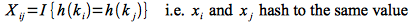
>
> From the simple uniform hashing assumption we know that
>
> 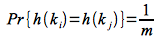
>
> An thus
>
> 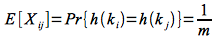
>
> Hence for a successful search we compute the expected value of the average number of searched elements over all *n* (using the above result and the fact that expected value is a linear operator)
>
> 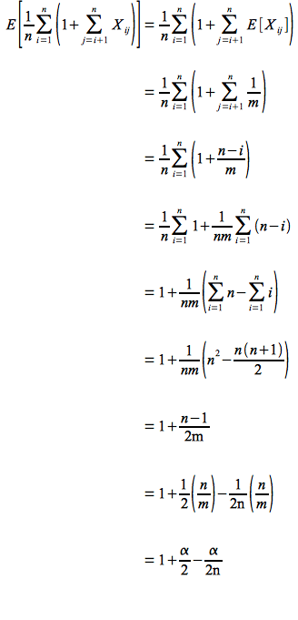
>
> Therefore the total time is Θ(1+(1+ α/2 - α/2*n*)) = Θ(1 + α) which is the same as the worst case. So unfortunately searching is no better asymptotically whether or not the element is in the table.

However since the search time is dependent on the number of slots (α). If *n* = O(*m*) ⇒ α = O(*m*)/*m* = O(1). Thus we can search in *constant time* (basically direct addressing) as long as the number of slots is the same as the number of elements we plan to store in the table.

Hashing Functions
=================

The question now is *how* do we construct a hashing function that satisfies the desired property of *simple uniform hashing*? The answer to this question is usually dependent on the distribution of the keys (which for a limited number can simply be a lookup table). However three common methods are the *division method*, *multiplication method*, and *universal hashing*.

**Division Method**

The division method is the simplest (and fastest) method of the form

> 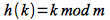

This method works well if the keys are relatively uniformly distributed as long as *m* is not close to a power of 2 (otherwise the hashing function simply extracts the low order bits of the key). Hence a good choice for *m* is a prime number not close to a power of 2. Thus if we wish to store *n* elements and want the maximum chain length to be *l*, then a good choice for the number of slots is

> 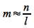

where we choose a nearby prime that is not close to a power of 2.

**Multiplication Method**

While the division method is simple and fast, it often does not produce good hashing particularly if the keys are not randomly distributed. An alternative method is the *multiplication method* of the form

> 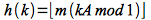

where *mod 1* indicates taking the fractional part of *kA* and 0 \< *A* \< 1. With this method the choice of *m* is *not* critical so often a power of 2 is chosen for computational efficiency. For example, if the architecture supports *w*-bit words and we choose *m* = 2p (such that *w* \> *p* and \|*k*\| \< 2p), then if we select an integer *s* and let *A* = *s*/2w \< 1 we can compute

> 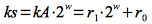

which gives a 2*w*-bit value of the form *r*12w + *r*0. It can then be shown that *h(k)* is simply the *p* high order bits of the low order word *r*0 as shown below

> 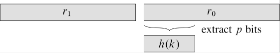

Thus we can compute the hash value efficiently through only integer multiplication and bit shift operations.

For good hashing, Knuth suggests a value for *A* of

> 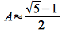

Note: This value turns out to be the negative conjugate of the *golden ratio*.

**Universal Hashing**

With any computational hashing function there is always the possibility that certain input distributions can produce worst case behavior (similar to the situation with quicksort). Thus again we will attempt to minimize this possiblity through a *random* hashing function that with high probability will produce good expected performance regardless of the key distribution. This method is known as *universal hashing*.

We wish to create a (finite) *set of hashing functions H* that map *U* → {0,1,...,m-1} with the property that:

> For any two *distinct* keys *k,l* ∈ *U*, the number of hash functions *h* ∈ *H* such that *h(k) = h(l)* (i.e. the two keys produce a collision) is ≤ \|*H*\|/*m*.

Thus if we *randomly* choose a hashing function *h* from the set *H*, the probability that any two keys produce a collision is 1/*m* ⇒ *uniform hashing*. A universal hashing function can be created using the following constructive procedure

*Construction*

1.  Select a prime number *p* such that for every key *k* (clearly *p* \> *m*)

    > 0 ≤ *k* ≤ *p*-1

2.  *Randomly* select a constant *a* such that

    > 1 ≤ *a* ≤ *p*-1

3.  *Randomly* select a constant *b* such that

    > 0 ≤ *b* ≤ *p*-1

4.  Construct the hashing function as

    > 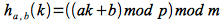

Using this procedure it can be shown that there are *p*(*p*-1) functions in *H* = {*h*a,b} that are universal. Since the function is chosen *randomly*, the probability of selecting a function that has two distinct keys hash to the same value is 1/*m*.

