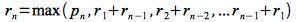

While we can almost always solve an optimization problem by a brute force approach, i.e. simply enumerate all possible solutions and determine which one is the best. However this process typically produces an *exponential* number of possibilities and hence is not feasible even for moderate input sizes. Often, however, the problem exhibits properties that allow it to be solved using a more procedural approach known as *dynamic programming*. This technique takes advantage of the characteristics of the optimal solution to reduce an otherwise exponential run time to polynomial time, i.e. produces an *efficient* solution which is often recursive in nature.

Dynamic Programming
===================

The key steps in a dynamic programming solution are

> -   *Characterize* the optimality - formally state what properties an optimal solution exhibits
> -   *Recursively* define an optimal solution - analyze the problem in a *top-down* fashion to determine how subproblems relate to the original
> -   *Solve* the subproblems - start with a base case and solve the subproblems in a *bottom-up* manner to find the optimal value
> -   *Reconstruct* the optimal solution - (optionally) determine the solution that produces the optimal value

Thus the process involves breaking down the original problem into subproblems that also exhibit optimal behavior. While the subproblems are not usually independent, we only need to solve each subproblem once and then *store* the values for future computations. To illustrate this procedure we will consider the problem of maximizing profit for *rod cutting*.

Rod Cutting
===========

**Problem**

Assume a company buys long steel rods and cuts them into shorter rods for sale to its customers. If each cut is free and rods of different lengths can be sold for different amounts, we wish to determine how to best cut the original rods to maximize the revenue.

**Brute Force Solution**

If we let the length of the rod be *n* inches and assume that we only cut integral lengths, there are 2n-1 different ways to cut the rod. This can be seen by assuming that at each inch increment we have a binary decision of whether or not to make a cut (obviously the last increment is not included since it does not produce any new pieces). Thus the number of permutations of lengths is equal to the number of binary patterns of *n-1* bits of which there are 2n-1. So to find the optimal value we simply add up the prices for all the pieces of each permutation and select the highest value. (Note that if we add the restriction that cuts must be made in order of nondecreasing length, then the number of cuts is significantly less but still exponential - see the note at the bottom of pg. 361 of CLRS.)

**Dynamic Programming Solution**

Let us first formalize the problem by assuming that a piece of length *i* has price *p*i. If the optimal solution cuts the rod into *k* pieces of lengths *i*1, *i*2, ... , *i*k, such that *n* = *i*1 + *i*2 + ... + *i*k, then the revenue for a rod of length *n* is

> 

Therefore the optimal value can be found in terms of shorter rods by observing that if we make an *optimal* cut of length *i* (and thus also giving a piece of length *n-i*) then both pieces *must be optimal* (and then these smaller pieces will subsequently be cut). Otherwise we could make a different cut which would produce a higher revenue contradicting the assumption that the first cut was *optimal*. Hence we can write the optimal revenue in terms of the first cut as the maximum of either the entire rod (*p*n) or the revenue from the two shorter pieces after a cut, i.e.

> 

If we assume that we do not further cut the first piece (since there must be at least one piece in the optimal solution) and only (possibly) cut the second part, we can rewrite the *optimal substructure* revenue formula recursively as

> 

where we repeat the process for each subsequent *r*n-i piece. Thus we can implement this approach using a simple recursive routine

    CUT-ROD(p,n)
    1.  if n == 0
    2.     return 0
    3.  q = -INF
    4.  for i = 1 to n
    5.     q = max(q,p[i] + CUT-ROD(p,n-i)
    6.  return q

The run time of this algorithm is given by the recursive equation

> 

where *T(j)* is the number of times the recursion occurs for each iteration of the **for** loop with *j* = *n-i*. The solution to this recursion can be shown to be *T(n)* = 2n which is still exponential behavior. The problem with the top-down naive solution is that we recompute all possible cuts thus producing the same run time as brute-force (only in a recursive fashion).

However if we can *store* the solutions to the smaller problems in a *bottom-up* manner rather than recompute them, the run time can be drastically improved (at the cost of additional memory usage). To implement this approach we simply solve the problems starting for smaller lengths and *store* these optimal revenues in an *array* (of size *n+1*). Then when evaluating longer lengths we simply *look-up* these values to determine the optimal revenue for the larger piece. We can formulate this recursively as follows

> 

Note that to compute any *r*j we only need the values *r*0 to *r*j-1 which we store in an array. Hence we will compute the new element using only *previously computed* values. The implementation of this approach is

    BOTTOM-UP-CUT-ROD(p,n)
    1.  let r[0..n] be a new array
    2.  r[0] = 0
    3.  for j = 1 to n
    4.     q = -INF
    5.     for i = 1 to j
    6.        q = max(q,p[i] + r[j-i])
    7.     r[j] = q
    8.  return r[n]

The run time of this implementation is simply

> 

Thus we have reduced the run time from *exponential* to *polynomial*! If in addition to the maximal revenue we want to know where to make the actual cuts we simply use an additional array *s[]* (also of size *n+1*) that stores the optimal cut for each segment size. Then we proceed backwards through the cuts by examining *s[i]* = *i* - *s[i]* starting at *i* = *n* to see where each subsequent cut is made until *i* = 0 (indicating that we take the last piece without further cuts). A modified implementation that explicitly performs the maximization to include *s[]* and print the final optimal cut lengths (which still has the same O(*n*2) run time) is given below

    EXTENDED-BOTTOM-UP-CUT-ROD(p,n)
    1.  let r[0..n] and s[0..n] be new arrays
    2.  r[0] = 0
    3.  for j = 1 to n
    4.     q = -INF
    5.     for i = 1 to j
    6.        if q < p[i] + r[j-i]
    7.           q = p[i] + r[j-i]
    8.           s[j] = i
    9.     r[j] = q
    10. // Print optimal cuts
    11. i = n 
    12. while i > 0
    13.    print s[i]
    14.    i = i - s[i]
    15. return r and s

**Example**

Consider the following price table

> length          |   0   |   1   |   2   |   3   |   4   |   5   |
> --------------- | ----- | ----- | ----- | ----- | ----- | ----- |
> *p*i |   0   |   3   |   5   |  10   |  12   |  14   |
> *r*i | **0** |   /   |   /   |   /   |   /   |   /   |
> *s*i |   /   |   /   |   /   |   /   |   /   |   /   |

Computing the *r*i's with *r*0 = 0

*r*1:

> 

> length          |   0   |   1   |   2   |   3   |   4   |   5   |
> --------------- | ----- | ----- | ----- | ----- | ----- | ----- |
> *p*i |   0   |   3   |   5   |  10   |  12   |  14   |
> *r*i |   0   | **3** |   /   |   /   |   /   |   /   |
> *s*i |   /   | **1** |   /   |   /   |   /   |   /   |

*r*2:

> 

> length          |   0   |   1   |   2   |   3   |   4   |   5   |
> --------------- | ----- | ----- | ----- | ----- | ----- | ----- |
> *p*i |   0   |   3   |   5   |  10   |  12   |  14   |
> *r*i |   0   |   3   | **6** |   /   |   /   |   /   |
> *s*i |   /   |   1   | **1** |   /   |   /   |   /   |

*r*3:

> 

> length          |   0   |   1   |   2   |   3   |   4   |   5   |
> --------------- | ----- | ----- | ----- | ----- | ----- | ----- |
> *p*i |   0   |   3   |   5   |  10   |  12   |  14   |
> *r*i |   0   |   3   |   6   |**10** |   /   |   /   |
> *s*i |   /   |   1   |   1   | **3** |   /   |   /   |

*r*4:

> 

> length          |   0   |   1   |   2   |   3   |   4   |   5   |
> --------------- | ----- | ----- | ----- | ----- | ----- | ----- |
> *p*i |   0   |   3   |   5   |  10   |  12   |  14   |
> *r*i |   0   |   3   |   6   |  10   |**13** |   /   |
> *s*i |   /   |   1   |   1   |   3   | **1** |   /   |

*r*5:

> 

> length          |   0   |   1   |   2   |   3   |   4   |   5   |
> --------------- | ----- | ----- | ----- | ----- | ----- | ----- |
> *p*i |   0   |   3   |   5   |  10   |  12   |  14   |
> *r*i |   0   |   3   |   6   |  10   |  13   |**16** |
> *s*i |   /   |   1   |   1   |   3   |   1   | **1** |

Hence the maximum revenue for a rod of length 5 is 16. We can reconstruct the cuts that give this revenue from the *s*i's using lines 10-14 of EXTENDED-BOTTOM-UP-CUT which gives

> 1 (for *s*5) ⇒ *i* = 5 - 1 = 4
>
> 1 (for *s*4) ⇒ *i* = 4 - 1 = 3
>
> 3 (for *s*3) ⇒ *i* = 3 - 3 = 0

So we should make two cuts of 1 and leave the remaining 3 uncut.

