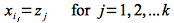

To futher illustrate using dynamic programming, another problem that can be solved with dynamic programming is finding the *longest common subsequence* between two sequences.

Sequences
=========

Given a sequence

> *X* = \<*x*1, *x*2, ..., *x*n\>

a sequence of length *k*

> *Z* = \<*z*1, *z*2, ..., *z*k\>

is a *subsequence* if there exists a *strictly increasing* set of indicies \<*i*1, *i*2, ..., *i*k\> such that

> 

In other words, all the elements of *Z* appear *in the same order* as they appear in *X* (but not necessarily consecutively).

For example, consider the seqence *X* = \<A, B, C, B, D, A\>. One subsequence is *Z* = \<B, C, D, A\> with indices *i* = \<2, 3, 5, 6\>.

Longest Common Subsequence
==========================

**Problem**

Given two sequences *X* of length *m* and *Y* of length *n* as

> *X* = \<*x*1, *x*2, ..., *x*m\>
>
> *Y* = \<*y*1, *y*2, ..., *y*n\>

find the *longest* common subsequence (LCS).

**Solution**

*Step 1: Characterize optimality*

The brute force procedure would involve enumerating all 2m subsequences of *X* (again simply consider all binary strings of length *m*) and check if they are also subsequences of *Y* keeping track of the longest one. Clearly this produces exponential run time and does not take advantage of the optimal substructure of the solution.

Define the *i*th *prefix* of a sequence as the first *i* elements

> *X*i = \<*x*1, *x*2, ..., *x*i\>

with *X*0 representing the empty sequence.

If we assume that *Z* = \<*z*1, *z*2, ..., *z*k\> is a LCS (with length *k*) of *X* and *Y* then one of the following three cases must hold:

> 1.  If *x*m = *y*n, then *z*k = *x*m = *y*n and *Z*k-1 is a LCS of *X*m-1, *Y*n-1 . Basically if the last elements of both sequences are the same then it must be the last element of the LCS and the *k-1* prefix of the LCS must be a LCS of the *m-1* and *n-1* prefixes of the original sequences.
> 2.  If *x*m ≠ *y*n, then if *z*k ≠ *x*m *Z* is a LCS of *X*m-1, *Y*. Basically if the last element of the LCS is *not* the same as the last element of *X* then it must be a LCS of the prefix of *X* without the last element.
> 3.  If *x*m ≠ *y*n, then if *z*k ≠ *y*n *Z* is a LCS of *X*, *Y*n-1. Basically if the last element of the LCS is *not* the same as the last element of *Y* then it must be a LCS of the prefix of *Y* without the last element.

In all three cases we see that the LCS of the original two sequences contains a LCS of *prefixes* of the two sequences (smaller versions of the original problem) ⇒ *optimal substructure problem*.

*Step 2: Define the recursive solution (top-down)*

Case 1 reduces to the *single* subproblem of finding a LCS of *X*m-1, *Y*n-1 and adding *x*m = *y*nto the end of *Z*.

Cases 2 and 3 reduces to *two* subproblems of finding a LCS of *X*m-1, *Y* and *X*, *Y*n-1and selecting the longer of the two (note both of these subproblems involve also solving the subproblem of Case 1).

Hence if we let *c[m,n]* be the length of a LCS for *X* and *Y* we can write the recursion described by the above cases as

> 

Since each step of the recursion removes at least one element from one of the sequences, there are only Θ(*mn*) subproblems to consider. Hence we can solve it by creating two tables - *C* an *m* x *n* table storing the LCS lengths and *B* an *m* x *n* table for reconstructing the LCS. 

Note that not all subproblems are considered depending on which recursive branch is selected.

*Step 3: Compute the length of the LCS (bottom-up)*

Replacing *m* by *i* and *n* by *j* and noting that *c[i,0] = c[0,j] = 0*, we can rewrite the recursive equation bottom up as follows

> 

When the procedure is complete, the optimal length of the LCS will be stored in *c[m,n]*. Thus since we fill in the entire table, the procedure will take O(*mn*).

*Step 4: Construct an optimal LCS*

Start at *any* entry containing the max-length (for example *c[m,n]*) and follow the arrows through the table adding elements in reverse order whenever a ↖ occurs. At worst we move up or left at each step giving a run time of O(*m* + *n*).

Alternatively we could avoid the *B* matrix (saving some space) and reconstruct the LCS from *C* at each step in O(1) time (using only the surrounding table cells), however it does not provide any improvement in the asymptotic run time.

**Example**

Consider the two sequences

> *X* = \<A, B, C, B, A\>
>
> *Y* = \<B, D, C, A, B\>

We will fill in the table row-wise starting in the upper left corner using the following formulas

> 

The completed table is given by

> *i*,*j*  |    |   0   |   1   |   2   |   3   |   4   |   5   |
> --- | ----- | ----- | ----- | ----- | ----- | ----- | ----- |
>     |       | **Y** | **B** | **D** | **C** | **A** | **B** |
>  0  | **X** |   0   |   0   |   0   |   0   |   0   |   0   |
>  1  | **A** |   0   |   0↑  |   0↑  |   0↑  |   1↖  |   1←  |
>  2  | **B** |   0   |   1↖  |   1←  |   1←  |   1↑  |   2↖  |
>  3  | **C** |   0   |   1↑  |   1↑  |   2↖  |   2←  |   2↑  |
>  4  | **B** |   0   |   1↖  |   1↑  |   2↑  |   2↑  |   3↖  |
>  5  | **A** |   0   |   1↑  |   1↑  |   2↑  |   3↖  |   3↑  |

Thus the optimal LCS length is *c[m,n]* = 3.

Constructing an optimal LCS starting at *c[5,5]* we get *Z* = \<B, C, B\> (added at elements *c[4,5]*, *c[3,3]*, and *c[2,1]*). Alternatively we could start at *c[5,4]* which would produce *Z* = \<B, C, A\>. Note that the LCS *is not unique* but the optimal length of the LCS *is*.

