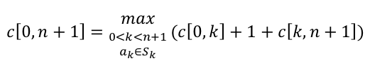
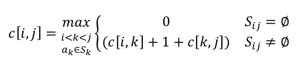
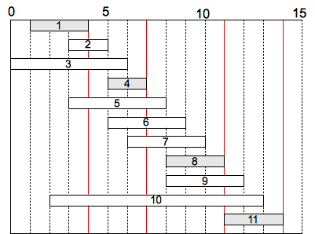

While dynamic programming can be successfully applied to a variety of optimization problems, many times the problem has an even more straightforward solution by using a *greedy approach*. This approach reduces solving multiple subproblems to find the optimal to simply solving one greedy one. Implementation of greedy algorithms is usually more straighforward and more efficient, but *proving* a greedy strategy produces optimal results requires additional work.

Activity Selection
==================

**Problem**

Given a set of *activities* *A* of length *n*

> *A* = \<*a*1, *a*2, ..., *a*n\>

with *starting times*

> *S* = \<*s*1, *s*2, ..., *s*n\>

and *finishing times*

> *F* = \<*f*1, *f*2, ..., *f*n\>

such that 0 ≤ *s*i \< *f*i \< ∞, we define two activities *a*i and *a*j to be *compatible* if

> *f*i ≤ *s*j **or** *f*j ≤ *s*i

i.e. one activity ends before the other begins so they do not overlap.

Find a *maximal* set of compatible activies, e.g. scheduling the most activities in a lecture hall. Note that we want to find the maximum *number* of activities, **not** necessarily the maximum *use* of the resource.

**Dynamic Programming Solution**

*Step 1: Characterize optimality*

Without loss of generality, we will assume that the *a*'s are sorted in non-decreasing order of finishing times, i.e. *f*1 ≤ *f*2 ≤ ... ≤ *f*n.

Furthermore, we can define boundary activities *a*0 such that *f*0 = 0, and *a*n+1 such that *s*n+1 = *f*n.

Define the set *S*ij

> *S*ij = {*a*k ∈ *S* : *f*i ≤ *s*k \< *f*k ≤ *s*j}

as the subset of activities that can occur between the completion of *a*i (*f*i) and the start of *a*j (*s*j).

Note that *S*ij = ∅ for *i* ≥ *j* since otherwise *f*i ≤ *s*j \< *f*j ⇒ *f*i \< *f*j which is a contradiction for *i* ≥ *j* by the assumption that the activities are in sorted order.

Furthermore let *A*ij be the *maximal* set of activities for *S*ij. Using a "cut-and-paste" argument, if *A*ij contains activity *a*k then we can write

> *A*ij = *A*ik ∪ {*a*k} ∪ *A*kj

where *A*ik and *A*kj must also be optimal (otherwise if we could find subsets with more activities that were still compatible with *a*k then it would contradict the assumption that *A*ij was optimal).

*Step 2: Define the recursive solution (top-down)*

Let *c[0,n+1]* = \|*A*0,n+1\|, i.e. *c* is the maximal number of compatible activities that start *after* *a*0 and end *before* *a*n+1. Then

> 

i.e. compute *c[0,n+1]* for each *k* = 1, ..., n and select the max.

*Step 3: Compute the maximal set size (bottom-up)*

Substituting *i* for 0 and *j* for *n+1* gives 

> 

with *c[i,j]* = 0 for *i* ≥ *j*.

Hence, construct an *n* x *n* table (which is upper triangular) that can be done in polynomial time since clearly for each *c[i,j]* we will examine no more than *n* subproblems giving an upper bound on the worst case of O(*n*3).

**BUT WE DON'T NEED TO DO ALL THAT WORK!** Instead at each step we could simply select (*greedily*) the activity that finishes first and is compatible with the previous activities. Intuitively this choice leaves the most time for other future activities.

**Greedy Algorithm Solution**

To use the greedy approach, we must *prove* that the greedy choice produces an optimal solution (although not necessarily the *only* solution).

Consider any non-empty subproblem *S*ij with activity *a*m having the earliest finishing time, i.e.

> *f*min = min{*f*k : *a*k ∈ *S*ij}

then the following two conditions must hold

> 1.  *a*m is used in an optimal subset of *S*ij
> 2.  *S*im = ∅ leaving *S*mj as the only subproblem

meaning that the greedy solution produces an optimal solution.

*Proof*

> 1.  Let *A*ij be an optimal solution for *S*ij and *a*k be the first activity in *A*ij
>
>     > → If *a*k = *a*m then the condition holds.
>     >
>     > → If *a*k ≠ *a*m then construct *A*ij' = *A*ij - {*a*k} ∪ {*a*m}. Since *f*m ≤ *f*k ⇒ *A*ij' is still optimal.
>
> 2.  If *S*im is non-empty ⇒ *a*k with
>
>     > *f*i ≤ *s*k \< *f*k ≤ *s*m\< *f*m
>     >
>     > ⇒ *f*k \< *f*m which contradicts the assumption that *f*m is the minimum finishing time. Thus *S*im = ∅.
>
Thus instead of having 2 subproblems each with *n*-*j*-1 choices per problem, we have reduced it to 1 subproblem with 1 choice.

*Algorithm*

Always start by choosing the first activity (since it finishes first), then repeatedly choose the next compatible activity until none remain. The algorithm can be implemented either recursively or iteratively in O(n) time (assuming the activities are sorted by finishing times) since each activity is examined only once.

**Example**

Consider the following set of activities represented graphically in non-decreasing order of finishing times

> 

Using the greedy strategy an optimal solution is {1, 4, 8, 11}. Note another optimal solution not produced by the greedy strategy is {2, 4, 8, 11}.

Greedy Algorithm Properties
===========================

A general procedure for creating a greedy algorithm is:

> 1.  Determine the optimal substructure (like dynamic programming)
> 2.  Derive a recursive solution (like dynamic programming)
> 3.  For every recursion, show *one* of the optimal solutions is the *greedy* one.
> 4.  Demonstrate that by selecting the *greedy* choice, *all* other subproblems are *empty*.
> 5.  Develop a recursive/iterative implementation.

Usually we try to cast the problem such that we only need to consider one subproblem and that the greedy solution to the subproblem is optimal. Then the subproblem along with the greedy choice produces the optimal solution to the original problem.

Dynamic Programming vs. Greedy Algorithms
=========================================

Often seemingly similar problems warrant the use of one or the other approach. For example consider the *knapsack problem*. Suppose a thief wishes to maximize the value of stolen goods subject to the limitation that whatever they take must fit into a fixed size knapsack (or subject to a maximum weight).

**0-1 Problem**

If there are *n* items with value *v*i and weight *w*i where the *v*i's and *w*i's are integers, find a subset of items with maximum total value for total weight ≤ *W*. This version requires *dynamic programming* to solve since taking the most valuable per pound item may not produce optimal results (if it precludes taking additional items).

**Fractional Problem**

Assume that fractions of items can be taken. This version can utilize a *greedy algorithm* where we simply take as much of the most valuable per pound items until the weight limit is reached.

