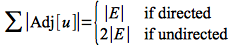

This lecture will be a brief review of terminology from graph theory that will be used for the algorithms in subsequent lectures. We assume that a graph *G(V,E)* is represented as a pair of *finite* sets where *V* is the set of vertices and *E* is the set of edges.

Directed Graph (digraph)
========================

In a *directed graph*, the edges are represented by *ordered pairs* of vertices (*u*, *v*) and shown diagramatically as directed arrows (a vertex may be connected to itself via a *self-loop*).

> 

An edge (*u*, *v*) is *incident from* (i.e. leaves) *u* and is *incident to* (i.e. enters) *v*. If a graph contains an edge (*u*, *v*), then *v* is *adjacent* to *u* and is represented notationally as *u* → *v*. Note *v* being adjacent to *u* *does not* imply that *u* is adjacent to *v* unless edge (*v*, *u*) ∈ *E*. Thus (*u*, *v*) and (*v*, *u*) are distinct edges in a directed graph.

We say that *u* and *v* are *neighbors* if either (*u*, *v*) ∈ *E* or (*v*, *u*) ∈ *E*.

For each vertex we define the *out-degree* as the number of edges leaving the vertex, *in-degree* as the number of edges entering a vertex, and the *degree* as *out-degree* + *in-degree* (i.e. total number of edges at the vertex). If a vertex has *degree* = 0, then the vertex is *isolated*.

If the directed graph has no self-loops, then it is a *simple directed graph*.

Undirected Graph
================

In an *undirected graph*, the edges are represented by *unordered pairs* of vertices. Thus (*u*, *v*) and (*v*, *u*) represent the same edge and are shown diagramatically as simply a connecting line (note undirected graphs may not contain self-loops).

> 

An edge (*u*, *v*) is *incident on* *u* and *v*, and *u* and *v* are *adjacent* to each other.

The *degree* is the number of edges incident on a vertex.

To convert an undirected graph into a directed one, simply replace each edge (*u*, *v*) with (*u*, *v*) and (*v*, *u*). Conversely to convert a directed graph into an undirected one, replace each edge (*u*, *v*) or (*v*, *u*) with (*u*, *v*) and remove all self-loops.

Paths
=====

A *path* of length *k* from *u* to *u*' is a sequence of vertices \<*v*0, *v*1, ..., *v*k\> with *u* = *v*0, *u*' = *v*k, and (*v*i-1, *v*i) ∈ *E*.

If a path *p* from *u* to *u*' exists, then *u*' is *reachable* from *u* (denoted *u* ↝ *u*' if *G* is a directed graph).

The path is *simple* if all the vertices are distinct.

A *subpath* is a contiguous subsequence \<*v*i, *v*i+1, ..., *v*j\> with 0 ≤ *i* ≤ *j* ≤ *k*.

A *cycle* is a path with *v*0 = *v*k (and is also simple if all the vertices except the end points are distinct). An *acyclic graph* is a graph with no cycles.

Connected Components
====================

In an undirected graph, a *connected component* is a subset of vertices thar are all reachable from each other. The graph is *connected* if it contains exactly one connected component, i.e. *every* vertex is reachable from *every* other.

In a directed graph, a *strongly connected component* is a subset of *mutually* reachable vertices, i.e. there is a path between any two vertices in the set.

Special Graphs
==============

A *complete* graph an undirected graph where *all* vertices are adjacent to all other vertices, i.e. there are edges between every pair of vertices.

A *bipartite* graph is an undirected graph that can be *partitioned* into *V*1 and *V*2 such that for every edge (*u*, *v*) ∈ *E* either

> *u* ∈ *V*1 and *v* ∈ *V*2 **OR** *u* ∈ *V*2 and *v* ∈ *V*1

i.e. the graph can be separated so that the only edges are between vertices in different subsets.

A *forest* is an undirected acyclic graph. If it is also connected, then it is a *tree*.

A directed acyclic graph is known as a *DAG*.

Graph Representation
====================

Two common methods for implementing a graph in software is either using an *adjacency list* or an *adjacency matrix*.

**Adjacency List**

In an adjacency list implementation, we simply store the adjacent vertices (i.e. edges) for each vertex in a linked list denoted **Adj**[*u*]. If we sum up the lengths of all the adjacency lists, we get either

> 

⇒ Θ(*V* + *E*) storage is required.

This representation is good for *sparse* graphs where \|*E*\| ≪ \|*V*\|2. One drawback is that to determine if an edge (*u*, *v*) ∈ *E* requires a list search ⇒ Θ(*V*).

For the original directed graph, the adjacency list would be

> 

**Adjacency Matrix**

In an adjacency matrix implementation, we store the edges in a *V*x*V* matrix *A* either as binary values or real numbers for weighted edges.

⇒ Θ(*V*2) storage is required (independent of *E*).

This representation is good for *dense* graphs where \|*E*\| ≈ \|*V*\|2. The advantage is it only takes Θ(1) time to determine if an edge (*u*, *v*) ∈ *E* since it is simply a matrix element access. If the graph is undirected, then *A* = *A*T so only the upper triangular half needs to be stored.

For the original directed graph, the adjacency matrix would be

> 

