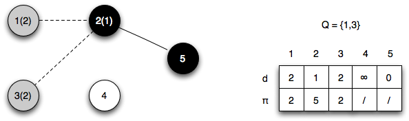

Now that we have reviewed the basic terminology associated with graphs, the first algorithm we will investigate is *breadth-first search*. This algorithm is used to find the shortest paths (by number of edges) to every reachable vertex from a given one.

Breadth-first Search
====================

**Problem**

Given a source vertex *s*, find the *shortest paths* (in terms of number of edges) to *every* reachable vertex from *s*.

**Solution**

The procedure we will use will find all vertices reachable at a distance *k* before discovering reachable vertices at a distance *k+1*. Ultimately, the algorithm will produce a *breadth-first tree* with *s* as the root.

During the execution of the algorithm, vertices will be *colored* (denoted by *u.color*). The colors represent the vertex's current state as follows

> -   **white** - the vertex is undiscovered (i.e. currently no path has been found to the vertex)
> -   **gray** - the vertex has been discovered and is on the *frontier*, i.e. there may be further vertices that can be discovered
> -   **black** - the vertex has been discovered and has been completely searched

The algorithm also uses two additional fields for each vertex

> *u*.π - predecessor vertex
>
> *u*.*d* - distance when the vertex is first discovered (and is subsequently the shortest distance from the source)

We will employ a queue *Q* which will track which vertices are currently under discovery. Thus vertices that have not yet been placed in *Q* will be **white**, those that are in *Q* will be **gray**, and those that have been removed from *Q* will be **black**.

**Algorithm**

The algorithm for breadth-first search is

	BFS(G,s)
	1.  for each vertex u ∈ G.V - {s}
	2.     u.color == WHITE
	3.     u.d = INF
	4.     u.pi = NIL
	5.  s.color = GRAY
	6.  s.d = 0
	7.  s.pi = NIL
	8.  Q = ∅
	9.  ENQUEUE(Q,s)
	10. while Q ≠ ∅
	11.    u = DEQUEUE(Q)
	12.    for each v ∈ G.Adj[u]
	13.       if v.color == WHITE
	14.          v.color = GRAY
	15.          v.d = u.d + 1
	16.          v.pi = u
	17.          ENQUEUE(Q,v)
	18.    u.color = BLACK

Basically the algorithm performs the following operations:

> 1.  Initialize *Q* with the source vertex *s*
> 2.  Dequeue the head vertex *u* from *Q* and mark as **black**
> 3.  Queue all white vertices adjacent to *u* marking them as **gray**, set their distance to *u*'s distance + 1, and set their π to *u*
> 4.  Repeat 2-3 until *Q* = ∅

**Analysis**

Since no vertex is ever enqueued/dequeued more than once ⇒ O(*V*)

Each adjacency list is only scanned once (when the vertex is dequeued) with max size the total number of edges ⇒ O(*E*)

Initialization overhead ⇒ O(*V*)

Thus the total run time for BFS is

> 

It can be proven that the algorithm produces the *shortest paths* (in terms of the minimum number of edges) to all reachable vertices from the source *s*. These paths can be represented by a *breadth-first tree* that is given by the predecessor subgraph

> 

In other words, the predecessor graph contains all the vertices with predecessors that are reachable plus the source and all the predecessor edges.

Furthermore, it can be shown that since the predecessor subgraph is a *tree*, by theorem B.2 of CLRS

> 

The predecessor tree can be traversed (using the π's) to give the shortest path from *s* to *v*.

**Example**

Conside the five node (undirected) graph

> 

If we select vertex 5 as the source, then *d*[5]=0, π[5]=/, *Q*={5}, thus the initialization gives

> 

*Iteration 1*: dequeue vertex 5 and enqueue vertex 2

> 

*Iteration 2*: dequeue vertex 2 and enqueue verticies 1,3

> 

*Iteration 3*: dequeue vertex 1 and enqueue vertex 4

> 

*Iteration 4*: dequeue vertex 3 and enqueue no vertices

> 

*Iteration 5*: dequeue vertex 4 and enqueue no vertices (thus leaving the queue empty)

> 

The final predecessor graph, i.e. breadth-first tree, for this BFS is

> 

