BFS is used to find the shortest paths (by number of edges) to every reachable vertex from a given one. Alternatively we may wish to follow a particular path to maximal depth and then backtrack to follow other paths in a *depth-first* fashion (DFS) creating a *forest* of *depth-first trees*. DFS does *not* give shortest paths but is useful as part of other algorithms.

Depth-first Search
==================

**Problem**

Given a source vertex *s*, follow a path to *maximal depth* and then backtrack to follow any remaining paths available from preceeding vertices. If after exploring the source any vertices remain undiscovered, begin another depth first search at an undiscovered vertex repeating until all vertices in the graph are fully explored.

**Solution**

The procedure we will use is similar to BFS, but instead of finding all vertices at distance *k* before locating vertices at distance *k+1* we will simply follow *any* path until no new vertices can be found along that path. Thus the resulting depth-first trees can vary depending on the order in which the vertices are traversed.

During the execution of the algorithm, vertices will again be *colored* (denoted by *u.color*) similarly to BFS. As a review, the colors represent the vertex's current state as follows

> -   **white** - the vertex is undiscovered (i.e. currently no path has been found to the vertex)
> -   **gray** - the vertex has been discovered and is on the *frontier*, i.e. there may be further vertices that can be discovered
> -   **black** - the vertex has been discovered and has been completely searched

The DFS algorithm uses similar fields as BFS but also requires a third one *f* as follows

> *u*.π - predecessor vertex
>
> *u*.*d* - timestamp when the vertex is first discovered (and is subsequently colored **gray**)
>
> *u*.*f* - timestamp when the vertex has been fully explored (and is subsequently colored **black**) ⇒ *u.d* \< *u.f*

At each step in the algorithm we increment the timestamp giving

> 1 ≤ *u.d* \< *u.f* ≤ 2\|*V*\| for all *u* ∈ *V*

Therefore a vertex will be **white** before *u.d*, **gray** between *u.d* and *u.f*, and **black** after *u.f*.

After DFS, all of the edges in the graph can then be classified as either:

> *Tree edge* - edge in one of the depth-first trees, i.e. *v* is first discovered from *u* ⇒ if *v* is **white** when (*u*,*v*) is explored, then (*u*,*v*) is a tree edge
>
> *Back edge* - non-tree edges connecting *u* to an *ancestor* of *v* ⇒ if *v* is **gray** when (*u*,*v*) is explored, then (*u*,*v*) is a back edge
>
> *Forward edge* - non-tree edges connecting *u* to a *decendant* of *v* ⇒ if *v* is **black** when (*u*,*v*) is explored and *u.d* \< *v.d*, then (*u*,*v*) is a forward edge
>
> *Cross edge* - all other edges ⇒ if *v* is **black** when (*u*,*v*) is explored and *v.d* \< *u.d*, then (*u*,*v*) is a cross edge

Note that forward and cross edges cannot occur if the graph is undirected.

Unlike BFS, DFS does not utilize a queue but rather recursively continues to follow edges in the adjacency lists until no additional ones are available. Thus DFS will produce different results based on the order vertices are followed.

**Algorithm**

The algorithm for depth-first search is

	DFS(G)
	1.  for each vertex u ∈ G.V
	2.     u.color = WHITE
	3.     u.pi = NIL
	4.  time = 0
	5.  for each vertex u ∈ G.V
	6.     if u.color == WHITE
	7.        DFS-VISIT(G,u)
	
	DFS-VISIT(G,u)
	1.  time = time + 1
	2.  u.d = time
	3.  u.color = GRAY
	4.  for each v ∈ G.Adj[u]
	5.     if v.color == WHITE
	6.        v.pi = u
	7.        DFS-VISIT(G,v)
	8.  u.color = BLACK
	9.  time = time + 1
	10. u.f = time

Basically the algorithm performs the following operations:

> 1.  Initialize all the vertices to **white**
> 2.  Recurse on any **white** vertex *u* coloring subsequent discovered vertices **gray** and incrementing the timestamp
> 3.  When no further recursion is possible (no other vertices in the current adjacency list are **white**) return up a level and recurse on any other **white** vertices
> 4.  Repeat 2-3 until no **white** vertices remain in the graph

**Analysis**

Lines 1-3 and 5-7 of DFS() run in O(*V*). The recursion of DFS-VISIT() searches all edges *once* for a total of O(*E*). Thus the total run time of DFS() is O(*V*+*E*).

**Example**

Consider the five node (directed) graph

> 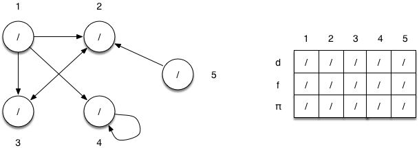

If we start at vertex 1 (and follow vertices in increasing numerical order), then

*Timestep 1*: *u*1.*d* = 1 and we follow edge (*u*1,*u*2)

> 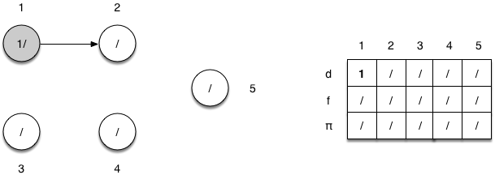

*Timestep 2*: *u*2.*d* = 2 and we follow edge (*u*2,*u*3)

> 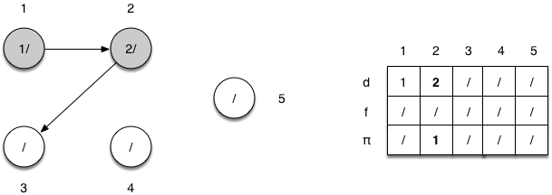

*Timestep 3*: *u*3.*d* = 3 (note edge (*u*3,*u*2) is a *back edge*)

> 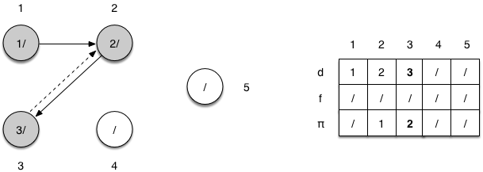

*Timestep 4*: there are no other edges to follow so *u*3.*f* = 4

> 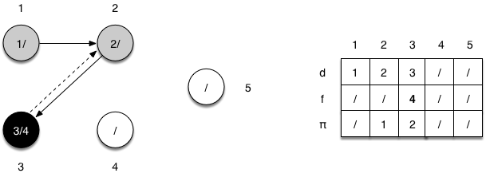

*Timestep 5*: there are no other edges to follow so *u*2.*f* = 5

> 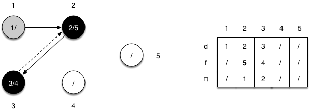

*Timestep 6*: follow edge (*u*1,*u*4) (note that edge (*u*1,*u*3) is a *forward edge*) so *u*4.*d* = 6

> 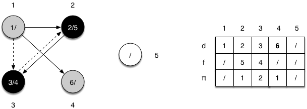

*Timestep 7*: there are no other edges to follow (note that edge (*u*4,*u*4) is a *back edge*) so *u*4.*f* = 7

> 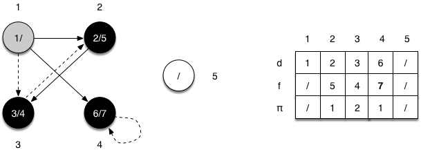

*Timestep 8*: there are no other edges to follow so *u*1.*f* = 8

> 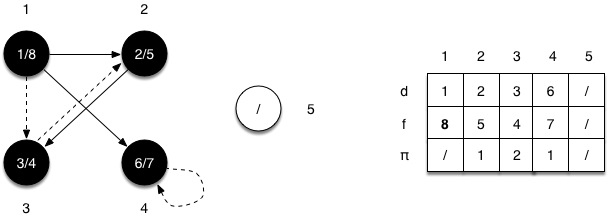

*Timestep 9*: there are no other edges to follow so begin a new tree at *u*5.*d* = 9

> 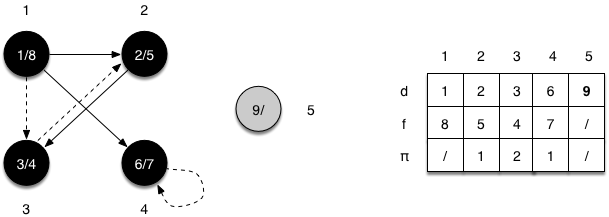

*Timestep 10*: there are no other edges to follow (note that edge (*u*5,*u*2) is a *cross edge*) so *u*5.*f* = 10

> 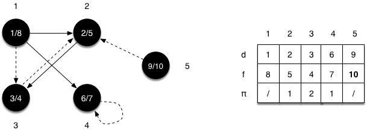

At this point there are no other **white** vertices so DFS terminates. The final depth-first trees are

> 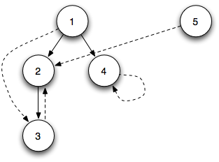

