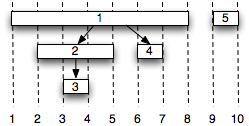
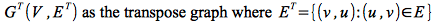
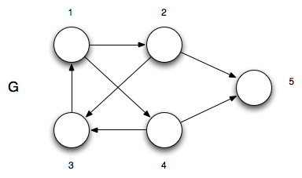
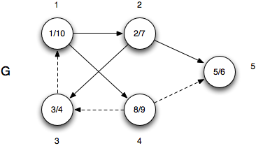
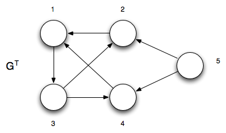
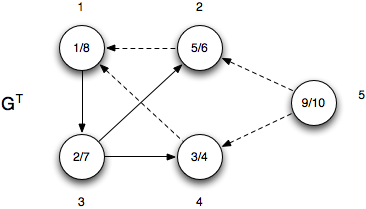
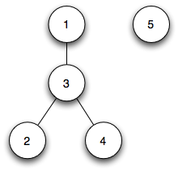

DFS can be used directly, but is more often used as an intermediate technique within another algorithm. This lecture examines three applications of DFS.

Parenthesis Theorem
===================

DFS can be applied to parenthetical expressions by considering the final *d*'s and *f*'s by observing that for any *u* and *v* either

> 1.  [*u.d*,*u.f*] and [*v.d*,*v.f*] are disjoint
> 2.  [*u.d*,*u.f*] is entirely within [*v.d*,*v.f*]
> 3.  [*v.d*,*v.f*] is entirely within [*u.d*,*u.f*]

If we view the depth-first tree from the example from [lecture 17](lecture17.html) as a timeline gives

> 

We can then substitute "(u" at each *u.d* and "u)" at each *u.f* such that the depth first tree (viewed as a timeline) represents a parenthetical expression. For example the final values above would represent the expression

> ( 1 ( 2 ( 33 ) 2 )( 44 ) 1 )( 55 )

Topological Sorting
===================

A second application of DFS is to create a directed ordering of nodes, e.g. task dependencies. This can be done based on an important theorem that can be shown using DFS

> A directed graph is *acyclic* (i.e. a DAG) *if and only if* a DFS produces *no* back edges.

Thus DFS can be used to test whether or not a graph has cycles on O(*V*+*E*) time.

Given a *directed acyclic graph* *G* (i.e. DAG, which can be determined via DFS), running DFS on *G* and sorting the vertices by *decreasing* finishing times produces a sequential ordering of the vertices. This can be seen since for any edge (*u*,*v*) in the depth-first tree, *u* must appear *before* *v* in the sorted list (since *G* is a DAG we know there are no back edges). For example, if the vertices represent a set of tasks with edges representing dependencies between tasks, a topological sort can be used to find a *critical path*. Since DFS runs in Θ(*V* + *E*), topological sort runs in the same time.

Strongly Connected Component Decomposition (SCCD)
=================================================

The third useful application of DFS is to perform a *strongly connected component decomposition*. Given a directed graph *G(V,E)*, the strongly connected component decomposition determines sets of vertices *C*i ∈ *V* such that for every pair *u*,*v* ∈ *C*i ⇒ *u* ↝ *v* **and** *v* ↝ *u*. In otherwords, it separates the graph into subsets of vertices that are mutually reachable from each other.

Define the *transpose* of a graph

> 

i.e. it is the original graph with all edges *reversed*. The transpose graph can be created in O(*V*+*E*) time if the graph is represented as an adjacency list.

It can then be shown that *u* and *v* are mutually reachable from each other in *G* **if and only if** *u* and *v* are mutually reachable from each other in *G*T.

Thus the procedure for finding strongly connected components is as follows:

> 1.  Run DFS on *G* to find *u.f*'s ⇒ O(*V*+*E*)
> 2.  Compute *G*T ⇒ O(*V*+*E*)
> 3.  Run DFS on *G*T considering the vertices in *decreasing order* of *u.f*'s from step 1 ⇒ O(*V*+*E*)

The resulting depth-first trees from step 3 are the strongly connected components of *G*. Furthermore, the running time of SCCD is Θ(*V*+*E*).

**Example**

Consider the following directed graph

> 

*Step 1 - Run DFS on G*

Running DFS on *G* (starting at vertex 1 and taking the vertices in numerical order) gives

> 

Thus the vertices in decreasing order of *u.f* is {1,4,2,5,3}.

*Step 2 - Compute G*T

The transpose *G*T is

> 

*Step 3 - Run DFS on G*T

Running DFS on *G*T taking the vertices in the order {1,4,2,5,3}

> 

The depth-first trees from step 3 are

> 

Hence the strongly connected components are {1,2,3,4} and {5}.

