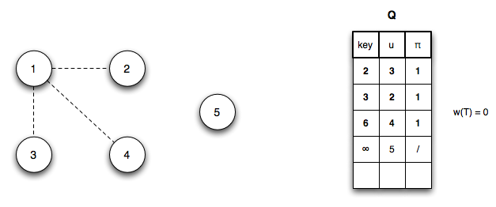

An alternative algorithm for finding MST's is *Prim's algorithm* which runs asymptotically faster than Kruskal's algorithm, but at the price of requiring a queue data structure.

Prim's Algorithm
================

*Prim's algorithm* finds MST's by *growing the MST* by adding light edges between the current tree and other vertices. The vertices are stored in a minimum *priority queue* based on the smallest weigh edge connecting vertices currently not in the tree with a vertex in the tree.

**Algorithm**

	MST-PRIM(G,w,r)
	1.  for each u ∈ G.V
	2.     u.key = ∞
	3.     u.pi = NIL
	4.  r.key = 0
	5.  Q = G.V
	6.  while Q ≠ ∅
	7.     u = EXTRACT-MIN(Q)
	8.     for each v ∈ G.Adj[u]
	9.        if v ∈ Q and w(u,v) < v.key
	10.          v.pi = u
	11.          v.key = w(u,v)

Basically the algorithm works as follows:

> 1.  Initialize *Q* and set the source (root) key to 0
> 2.  While *Q* is not empty, dequeue the vertex with minimum weight edge and add it to the tree by adding edge (*u*.π,*u*) to *T*
> 3.  For each vertex *v* in Adj[*u*] that is still in *Q*, check if *w(u,v)* (the edge weights from *u* for all vertices not in *T*) are less than the current *v.key* (the current smallest edge weight) and if so update the predecessor and key fields

The run time of Prim's algorithm depends on the implementation of the priority queue, but can be made to run in O(*E* + *V* lg *V*) using a *Fibonacci heap* for the priority queue.

**Example**

Using the same undirected graph from [lecture 19](lecture19.html)

> 

We will (arbitrarily) initialize *Q* with vertex 1 giving

> 

*Step 1*: Dequeue vertex 1 and update *Q* (and reprioritizing) by changing *u*3*.key* = 2 (edge (*u*1,*u*3)), *u*2*.key* = 3 (edge (*u*1,*u*2)), *u*4*.key* = 6 (edge (*u*1,*u*4))

> 

*Step 2*: Dequeue vertex 3 (adding edge (*u*1,*u*3) to *T*) and update *Q* (and reprioritizing) by changing *u*4*.key* = 4 (edge (*u*3,*u*4))

> 

*Step 3*: Dequeue vertex 2 (adding edge (*u*1,*u*2) to *T*) and update *Q* (and reprioritizing) by changing *u*5*.key* = 2 (edge (*u*2,*u*5))

> 

*Step 4*: Dequeue vertex 5 (adding edge (*u*2,*u*5) to *T*) with no updates to *Q*

> 

*Step 5*: Dequeue vertex 4 (adding edge (*u*3,*u*4) to *T*) with no updates to *Q*

> 

At this point *Q* = ∅ giving the final MST

> 

with total weight 11.

