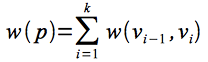
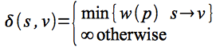
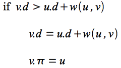
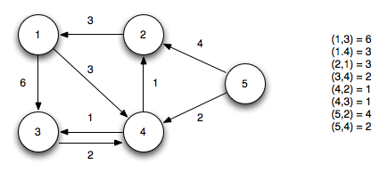
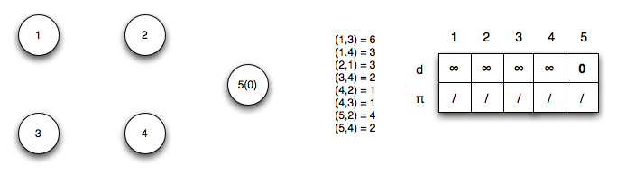
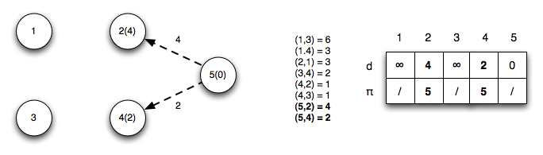
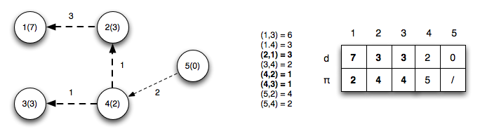
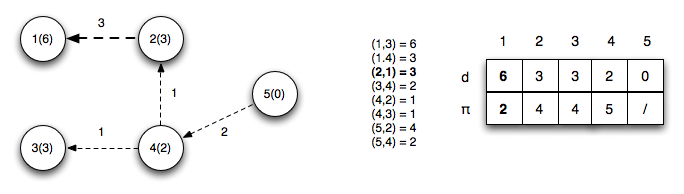
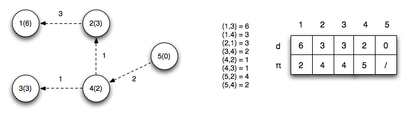
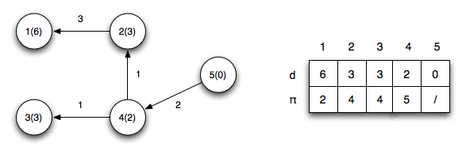

MST solves the problem of finding a minimum total weight subset of edges that spans all the vertices. Another common graph problem is to find the shortest paths to all reachable vertices from a given source. We have already seen how to solve this problem in the case where all the edges have the *same* weight (in which case the shortest path is simply the minimum *number* of edges) using BFS. Now we will examine two algorithms for finding *single source shortest paths* for directed graphs when the edges have *different* weights - Bellman-Ford and Dijkstra's algorithms. Several related problems are:

> -   Single destination shortest path - find the transpose graph (i.e. reverse the edge directions) and use single source shortest path
> -   Single pair shortest path (i.e. a specific destination) - asymptotically this problem can be solved no faster than simply using single source shortest path algorithms to all the vertices
> -   All pair shortest paths - one technique is to use single source shortest path for each vertex, but later we will see a more efficient algorithm

Single Source Shortest Path
===========================

**Problem**

Given a directed graph *G(V,E)* with *weighted edges* *w(u,v)*, define the *path weight* of a path *p* as

> 

For a given source vertex *s*, find the *minimum weight paths* to every vertex reachable from *s* denoted

> 

The final solution will satisfy certain caveats:

> -   The graph cannot contain any *negative weight cycles* (otherwise there would be no minimum path since we could simply continue to follow the negative weight cycle producing a path weight of -∞).
> -   The solution cannot have any *positive weight cycles* (since the cycle could simply be removed giving a lower weight path).
> -   The solution can be assumed to have no zero weight cycles (since they would not affect the minimum value).

Therefore given these caveats, we know the shortest paths must be *acyclic* (with ≤ \|*V*\| distinct vertices) ⇒ ≤ \|*V*\| - 1 edges in each path.

**Generic Algorithm**

The single source shortest path algorithms use the same notation as BFS (see [lecture 17](lecture17.html)) with predecessor π and distance *d* fields for each vertex. The optimal solution will have *v.d* = δ(*s*,*v*) for all *v* ∈ *V*.

The solutions utilize the concept of *edge relaxation* which is a test to determine whether going through edge (*u*,*v*) reduces the distance to *v* and if so update *v.*π and *v.d*. This is accomplished using the condition

> 

Bellman-Ford Algorithm
======================

The *Bellman-Ford algorithm* uses relaxation to find single source shortest paths on directed graphs that may contain *negative weight edges*. The algorithm will also detect if there are any *negative weight cycles* (such that there is no solution).

	BELLMAN-FORD(G,w,s)
	1.  INITIALIZE-SINGLE-SOURCE(G,s)
	2.  for i = 1 to |G.V| - 1
	3.     for each edge (u,v) ∈ G.E
	4.        RELAX(u,v,w)
	5.  for each edge (u,v) ∈ G.E
	6.     if v.d > u.d + w(u,v)
	7.        return FALSE
	8.  return TRUE

	INITIALIZE-SINGLE-SOURCE(G,s)
	1.  for each vertex v ∈ G.V
	2.     v.d = ∞
	3.     v.pi = NIL
	4.  s.d = 0
	
	RELAX(u,v,w)
	1.  if v.d > u.d + w(u,v)
	2.     v.d = u.d + w(u,v)
	3.     v.pi = u

Basically the algorithm works as follows:

> 1.  Initialize *d*'s, π's, and set *s.d* = 0 ⇒ O(*V*)
> 2.  Loop \|*V*\|-1 times through all edges checking the relaxation condition to compute minimum distances ⇒ (\|*V*\|-1) O(*E*) = O(*VE*)
> 3.  Loop through all edges checking for negative weight cycles which occurs if any of the relaxation conditions fail ⇒ O(*E*)

The run time of the Bellman-Ford algorithm is O(*V* + *VE* + *E*) = O(*VE*).

Note that if the graph is a DAG (and thus is known to not have any cycles), we can make Bellman-Ford more efficient by first *topologically sorting* *G* (O(*V*+*E*)), performing the same initialization (O(*V*)), and then simply looping through each vertex *u* *in topological order* relaxing only the edges in Adj[*u*] (O(*E*)). This method only takes O(*V* + *E*) time. This procedure (with a few slight modifications) is useful for finding *critical paths* for PERT charts.

**Example**

Given the following directed graph

> 

Using vertex 5 as the source (setting its distance to 0), we initialize all the other distances to ∞.

> 

*Iteration 1*: Edges (*u*5,*u*2) and (*u*5,*u*4) relax updating the distances to 2 and 4

> 

*Iteration 2*: Edges (*u*2,*u*1), (*u*4,*u*2) and (*u*4,*u*3) relax updating the distances to 1, 2, and 4 respectively. Note edge (*u*4,*u*2) finds a shorter path to vertex 2 by going through vertex 4

> 

*Iteration 3*: Edge (*u*2,*u*1) relaxes (since a shorter path to vertex 2 was found in the previous iteration) updating the distance to 1

> 

*Iteration 4*: No edges relax

> 

The final shortest paths from vertex 5 with corresponding distances is

> 

*Negative cycle checks*: We now check the relaxation condition one additional time for each edge. If any of the checks pass then there exists a negative weight cycle in the graph.

> *v*3*.d* \> *u*1*.d* + *w*(1,3) ⇒ 4 ≯ 6 + 6 = 12 ✓
>
> *v*4*.d* \> *u*1*.d* + *w*(1,4) ⇒ 2 ≯ 6 + 3 = 9 ✓
>
> *v*1*.d* \> *u*2*.d* + *w*(2,1) ⇒ 6 ≯ 3 + 3 = 6 ✓
>
> *v*4*.d* \> *u*3*.d* + *w*(3,4) ⇒ 2 ≯ 3 + 2 = 5 ✓
>
> *v*2*.d* \> *u*4*.d* + *w*(4,2) ⇒ 3 ≯ 2 + 1 = 3 ✓
>
> *v*3*.d* \> *u*4*.d* + *w*(4,3) ⇒ 3 ≯ 2 + 1 = 3 ✓
>
> *v*2*.d* \> *u*5*.d* + *w*(5,2) ⇒ 3 ≯ 0 + 4 = 4 ✓
>
> *v*4*.d* \> *u*5*.d* + *w*(5,4) ⇒ 2 ≯ 0 + 2 = 2 ✓

Note that for the edges *on the shortest paths* the relaxation criteria gives equalities.

Additionally, the path to any reachable vertex can be found by starting at the vertex and following the π's back to the source. For example, starting at vertex 1, *u*1.π = 2, *u*2.π = 4, *u*4.π = 5 ⇒ the shortest path to vertex 1 is {5,4,2,1}.

