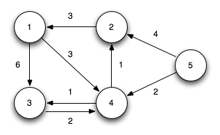
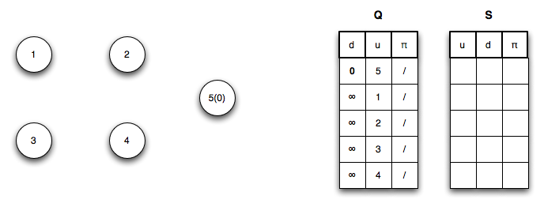
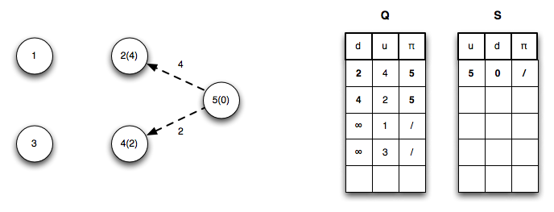
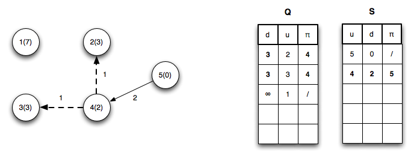
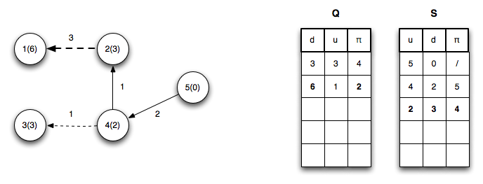
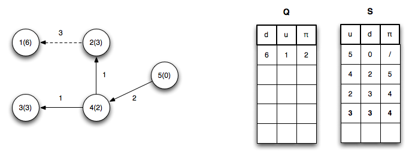
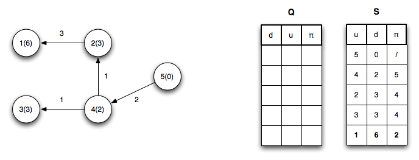
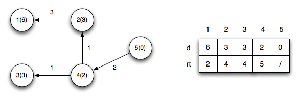

Just as Prim's algorithm improved on Kruskal's algorithm for MST's through the use of a priority queue, *Dijkstra's algorithm* improves on Bellman-Ford for single source shortest path also through the use of a priority queue. Unlike Bellman-Ford, however, Dijkstra's algorithm requires that all the weights are *non-negative* otherwise the algorithm may fail.

Dijkstra's Algorithm
====================

Dijkstra's algorithm maintains a set *S* of vertices where minimum paths have been found and a priority queue *Q* of the remaining vertices under discovery ordered by increasing *u.d*'s.

	DIJKSTRA(G,w,s)
	1.  INITIALIZE-SINGLE-SOURCE(G,s)
	2.  S = ∅
	3.  Q = G.V
	4.  while Q ≠ ∅
	5.     u = EXTRACT-MIN(Q)
	6.     S = S ∪ {u}
	7.     for each vertex v ∈ G.Adj[u]
	8.        RELAX(u,v,w)

	INITIALIZE-SINGLE-SOURCE(G,s)
	1.  for each vertex v ∈ G.V
	2.     v.d = ∞
	3.     v.pi = NIL
	4.  s.d = 0
	
	RELAX(u,v,w)
	1.  if v.d > u.d + w(u,v)
	2.     v.d = u.d + w(u,v)
	3.     v.pi = u

Basically the algorithm works as follows:

> 1.  Initialize *d*'s, π's, set *s.d* = 0, set *S* = ∅, and *Q* = G.V (i.e. put all the vertices into the queue with the source vertex having the smallest distance)
> 2.  While the queue is not empty, extract the minimum vertex (whose distance will be the shortest path distance at this point), add this vertex to *S*, and relax (using the same condition as Bellman-Ford) all the edges in the vertex's adjacency list for vertices still in *Q* reprioritizing the queue if necessary

The run time of Dijkstra's algorithm depends on how *Q* is implemented:

> Simple array with search ⇒ O(*V*2 + *E*) = O(*V*2)
>
> Binary min-heap (if *G* is sparse) ⇒ O((*V* + *E*) lg *V*) = O(*E* lg *V*)
>
> Fibonacci heap ⇒ O(*V* lg *V* + *E*)

**Example**

Using the same directed graph from [lecture 21](lecture21.html)

> 

Using vertex 5 as the source (setting its distance to 0), we initialize all the other distances to ∞, set *S* = ∅, and place all the vertices in the queue (resolving ties by lowest vertex number)

> 

*Iteration 1*: Dequeue vertex 5 placing it in *S* (with a distance 0) and relaxing edges (*u*5,*u*2) and (*u*5,*u*4) then reprioritizing the queue

> 

*Iteration 2*: Dequeue vertex 4 placing it in *S* (with a distance 2) and relaxing edges (*u*4,*u*2) and (*u*4,*u*3) then reprioritizing the queue. Note edge (*u*4,*u*2) finds a shorter path to vertex 2 by going through vertex 4

> 

*Iteration 3*: Dequeue vertex 2 placing it in *S* (with a distance 3) and relaxing edge (*u*2,*u*1) then reprioritizing the queue.

> 

*Iteration 4*: Dequeue vertex 3 placing it in *S* (with a distance 3) and relaxing no edges then reprioritizing the queue.

> 

*Iteration 5*: Dequeue vertex 1 placing it in *S* (with a distance 6) and relaxing no edges.

> 

The final shortest paths from vertex 5 with corresponding distances is

> 

Just like Bellman-Ford, the path to any reachable vertex can be found by starting at the vertex and following the π's back to the source. For example, starting at vertex 1, *u*1.π = 2, *u*2.π = 4, *u*4.π = 5 ⇒ the shortest path to vertex 1 is {5,4,2,1}.

