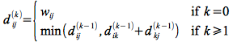

Bellman-Ford and Dijkstra's algorithms provide a means to find the shortest path from a *given* source. However often we may wish to find the shortest paths between *all pairs* of vertices. One way to accomplish this would be to simply run Bellman-Ford or Dijkstra's algorithm for each vertex in the graph. Thus the run times for these strategies would be (particularly for dense graphs where \|*E*\| ≈ \|*V*\|2):

> **Bellman-Ford** - \|*V*\| O(*VE*) ≈ O(*V*4)
>
> **Dijkstra** - \|*V*\| O(*V*2 + *E*) ≈ O(*V*3)
>
> > \|*V*\| O(*V* lg *V* + *E*) ≈ O(*V*2 lg *V* + *VE*)

In the case of dense graphs an often more efficient algorithm (with very low hidden constants) for finding all pairs shortest paths is the *Floyd-Warshall algorithm*.

Floyd-Warshall Algorithm
========================

The Floyd-Warshall algorithm works based on a property of *intermediate* vertices of a shortest path. An *intermediate* vertex for a path *p* = \<*v*1, *v*2, ..., *v*j\> is any vertex other than *v*1 or *v*j.

If the vertices of a graph *G* are indexed by {1, 2, ..., *n*}, then consider a subset of vertices {1, 2, ..., *k*}. Assume *p* is a minimum weight path from vertex *i* to vertex *j* whose intermediate vertices are drawn from the subset {1, 2, ..., *k*}. If we consider vertex *k* on the path then either:

> *k* is **not** an intermediate vertex of *p* (i.e. is not used in the minimum weight path)
>
> > ⇒ all intermediate vertices are in {1, 2, ..., *k*-1}
>
> *k* is an intermediate vertex of *p* (i.e. is used in the minimum weight path)
>
> > ⇒ we can divide *p* at *k* giving two subpaths *p*1 and *p*2 giving *v*i ↝ *k* ↝ *v*j
> >
> > ⇒ by Lemma 24.1 (subpaths of shortest paths are also shortest paths) subpaths *p*1 and *p*2 are shortest paths with intermediate vertices in {1, 2, ..., *k*-1}

Thus if we define a quantity *d*(k)ij as the minimum weight of the path from vertex *i* to vertex *j* with intermediate vertices drawn from the set {1, 2, ..., *k*} the above properties give the following recursive solution

> 

Thus we can represent the optimal values (when *k* = *n*) in a matrix as

> 

**Algorithm**

Basically the algorithm works by repeatedly exploring paths between every pair using each vertex as an intermediate vertex.

<pre>
	FLOYD-WARSHALL(W)
	1.  n = W.rows
	2.  D(0) = W
	3.  Π(0) = π(0)ij = NIL if i = j or wij = ∞
	                 = i   if i ≠ j and wij &lt; ∞
	4.  for k = 1 to n
	5.     let D(k) = (d(k)ij) be a new <i>n</i> x <i>n</i> matrix
	6.     for i = 1 to n
	7.        for j = 1 to n
	8.           dkij = min(d(k-1)ij, d(k-1)ik + d(k-1)kj)
	9.           if d(k-1)ij &le; d(k-1)ik + d(k-1)kj
	10.             π(k)ij = π(k-1)ij
	11.          else
	12.             π(k)ij = π(k-1)kj
	13. return D(n)
</pre>

Since Floyd-Warshall is simply three (tight) nested loops, the run time is clearly O(*V*3).

**Example**

Using the same directed graph from [lecture 22](lecture22.html) and [lecture 23](lecture23.html)

> 

*Initialization*: (*k* = 0)

> 

*Iteration 1*: (*k* = 1) Shorter paths from 2 ↝ 3 and 2 ↝ 4 are found through vertex 1

> 

*Iteration 2*: (*k* = 2) Shorter paths from 4 ↝ 1, 5 ↝ 1, and 5 ↝ 3 are found through vertex 2

> 

*Iteration 3*: (*k* = 3) No shorter paths are found through vertex 3

> 

*Iteration 4*: (*k* = 4) Shorter paths from 1 ↝ 2, 1 ↝ 3, 2 ↝ 3, 3 ↝ 1, 3 ↝ 2, 5 ↝ 1, 5 ↝ 2, 5 ↝ 3, and 5 ↝ 4 are found through vertex 4

> 

*Iteration 5*: (*k* = 5) No shorter paths are found through vertex 5

> 

The final shortest paths for all pairs is given by

> 

**Transitive Closure**

Floyd-Warshall can be used to determine whether or not a graph has *transitive closure*, i.e. whether or not there are paths between all vertices.

> -   Assign all edges in the graph to have weight = 1
> -   Run Floyd-Warshall
> -   Check if *all* *d*ij \< *n*

This procedure can implement a slightly more efficient algorithm through the use of logical operators rather than min() and +.

Johnson's Algorithm
===================

While Floyd-Warshall is efficient for dense graphs, if the graph is sparse then an alternative all pairs shortest path strategy known as *Johnson's algorithm* can be used. This algorithm basically uses Bellman-Ford to detect any negative weight cycles and then employs the technique of *reweighting* the edges to allow Dijkstra's algorithm to find the shortest paths. This algorithm can be made to run in O(*V*2 lg *V* + *VE*).

