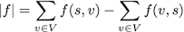
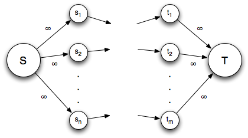
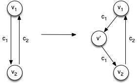
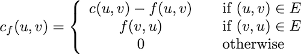
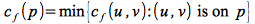

The last type of graph problem we will investigate is *maximum flow* problems. Intuitively, these problems can be thought of as starting with a *source* faucet that can provide as much water as possible. The faucet is connected to a *sink* drain that can handle any amount of water through a *network* of pipes. The pipes are of different sizes, i.e. have different *capacities* which limit the *flow* through certain branches of the network. The problem is to determine what is the *maximal flow*, i.e. the most water, that can travel through the network from the faucet to the drain.

Maximum Flow
============

We shall now formalize the *maximum flow* problem in graph terms, state some key definitions for network flows, and prove a very important theorem that will serve as the foundation for the algorithms.

Given a *flow network* *G*(*V*, *E*) which is a *connected, directed* graph with each edge (*u*,*v*) having a *capacity* *c*(*u*,*v*) ≥ 0 (assuming *c*(*u*,*v*) = 0 if (*u*,*v*) ∉ *E*), a *source* vertex *s*, and a *sink* vertex *t*: a *flow* is a function between all pairs of vertices that satisfies

> 1.  0 ≤ *f*(*u*,*v*) ≤ *c*(*u*,*v*) for all *u*,*v* (*capacity constraint*)
> 2.  Σ *f*(*v*,*u*) = Σ *f*(*u*,*v*) for all *v* *except* *s*,*t* (*flow conservation*, i.e. flow in = flow out)

If (*u*,*v*) ∉ *E* then *f*(*u*,*v*) = 0. Furthermore, we restrict the graph to not contain both (*u*,*v*) and (*v*,*u*).

The *value* of a flow is defined as

> 

which is the total amount *out* of the source minus the total amount *into* the source (which is often 0). 

**Problem**

Given *G*, *s*, and *t* find the *maximal flow value*.

*Multiple Source/Sinks*

The problem of multiple sources and/or sinks can be easily recast as a single source, single sink problem by creating "super" source and sink nodes with edges of *infinite* capacity between the "super" nodes and the network source/sinks as illustrated below.

> 

*Antiparallel Edges*

Often a problem may be represented as a graph that contains *antiparallel* edges, i.e. edges between the same vertices but in opposite directions, that have different capacities, e.g. consider upload/download speeds in a traditional computer communication network. This violates the condition that the graph cannot contain both edges. Thus we will make a modification to the flow network to replace one of the antiparallel edges with two edges having the same capacity but connected through a new intermediate vertex as shown below.

> 

Residual Networks
=================

A *residual network* is an *induced graph* that contains edges that can admit more flow, i.e. the edges that are not at capacity. The *residual capacity* of any edge is given by

> 

Thus the residual network consists of *residual edges* for which *c*f(*u*,*v*) \> 0. Note that as flow is increased along edges in the original graph, reverse residual edges need to be added to the residual network in the opposite direction (note, these edges were not present in the original network) and thus will produce *unique* antiparallel edges. This will allow for "decreasing" the flow along an edge in the original network.

Augmenting Paths
================

An *augmenting path* is a *simple path* from *s* ↝ *t* in the residual network. In other words it is an entire path which can admit additional flow from the source to the sink (all edges along the path have residual capacity). The *residual capacity of an augmenting path* is the maximum amount of additional flow that can be admitted along an augmenting path - which is limited by the *edge* with *minimum* residual capacity.

> 

Cuts
====

A *cut* is a partition of *V* into sets *S* and *T* such that *s* ∈ *S* and *T* = *V* - *S* has *t* ∈ *T*. This is similar to MST cuts except that the source must be in one partition and the sink in the other partition (and the graph is directed).

The *net flow* across the cut is *f*(*S*,*T*) and the *capacity* of the cut is *c*(*S*,*T*), which by flow conservation is the flow in the network \|*f*\|.

A *minimum cut* is a cut with *minimum capacity*. Furthermore, the value of any flow is upper bounded by the capacity of any cut.

Max-flow Min-cut Theorem
========================

Using the above definitions, the following theorem can be proven:

> If *f* is a flow in a network *G* with source *s* and sink *t*, then the following three statements are equivalent:
>
> > 1.  *f* is a *maximum flow* in *G* (with value \|*f* \*\|)
> > 2.  The *residual network* contains **no** *augmenting paths*.
> > 3.  \|*f* \| = *c*(*S*,*T*) for some cut (*S*,*T*) of *G*

Generic Ford-Fulkerson Method
==============================

By the max-flow, min-cut theorem, a maximal flow can be found by continually augmenting flow along paths with residual capacity, i.e.

<pre>
	1 Initialize f to 0
	2 while there exists an augmenting path p in the residual network Gf
	3     augment the flow f along p 
	4 return f
</pre>	

While this algorithm is not particularly useful for implementation, we can observe that for integer capacities the algorithm runs in O(*E*\|*f* \*\|) since each iteration checks at most *E* edges (e.g. BFS) and increases the flow by at least 1.

