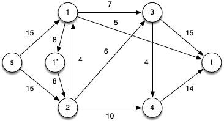
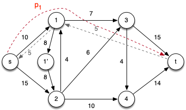
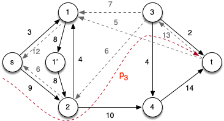
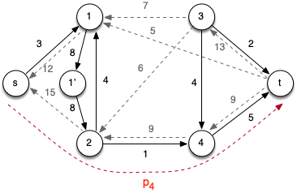
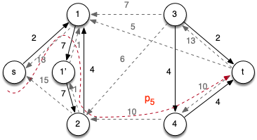
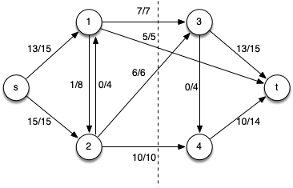
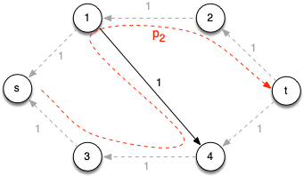

Last lecture provided the framework for maximum flow problems and proved the key theorem - max-flow min-cut - that all algorithms are based on. This lecture we will investigate an algorithm for computing maximal flows known as *Ford-Fulkerson*.

Ford-Fulkerson Algorithm
========================

The *Ford-Fulkerson algorithm* builds upon the general strategy presented last time.

<pre>
	1  for each edge (u,v) ∈ G.E
	2     (u,v).f = 0
	3  while there exists a path p from s to t in the residual network Gf
	4     cf(p) = min{ cf(u,v) : (u,v) is in p}
	5     for each edge (u,v) in p
	6        if (u,v) ∈ G.E
	7           (u,v).f = (u,v).f + cf(p)
	8        else (v,u).f = (v,u).f - cf(p)
	9  return f
</pre>

This algorithm runs efficiently as long as the value of the maximal flow \|*f* \*\| is reasonably small or if poor augmenting paths are avoided.

Edmonds-Karp Algorithm
======================

An extension that improves upon the basic Ford-Fulkerson method is the *Edmonds-Karp algorithm*. This algorithm finds the augmenting path using BFS ignoring the residual capacities. Thus BFS finds a *shortest path* (in terms of number of edges) to use as the augmenting path. With this modification, it can be shown that Edmonds-Karp runs in O(*VE*2).

**Example**

Consider the following flow network

> 

Initially we will remove the anti-parallel edges between vertices 1 and 2 by adding an intermediate vertex 1' and edges with the same capacities, i.e. *c*(1,1') = *c*(1',2) = *c*(1,2) = 8.

> 

Note that clearly \|*f* \*\| ≤ 29 (the smaller of the capacities leaving the source or entering the sink).

*Iteration 1:* Choose the augmenting path *p*1 = \< *s*, 1, *t* \> which has *c*f(*p*1) = 5 (due to *c*(1,*t*)) giving \|*f*\| = 5 and the residual network

> 

(note the addition of edges (1,*s*) and (*t*,1) with *c*f = 5).

*Iteration 2:* Choose the augmenting path *p*2 = \< *s*, 1, 3, *t* \> which has *c*f(*p*2) = 7 (due to *c*(1,3)) giving \|*f*\| = 12 and the residual network

> 

*Iteration 3:* Choose the augmenting path *p*3 = \< *s*, 2, 3, *t* \> which has *c*f(*p*3) = 6 (due to *c*(2,3)) giving \|*f*\| = 18 and the residual network

> 

*Iteration 4:* Choose the augmenting path *p*4 = \< *s*, 2, 4, *t* \> which has *c*f(*p*4) = 9 (due to *c*(*s*,2)) giving \|*f*\| = 27 and the residual network

> 

*Iteration 5:* Choose the augmenting path *p*5 = \< *s*, 1, 1', 2, 4, *t* \> which has *c*f(*p*5) = 1 (due to *c*(2,4)) giving \|*f*\| = 28 and the residual network

> 

At this point there are no other augmenting paths. Hence the final flow network with a min-cut shown is

> 

with maximal flow \|*f* \*\| = 28.

**Note** As we admit flow along an edge (*u*,*v*), we add or increase flow along the reverse edge (*v*,*u*), i.e. the flow provides capacity for that edge.

Consider the following example

> 

Clearly we can see that the max flow is \|*f* \*\| = 2 since we could follow paths across the top (*p*1 = \< *s*, 1, 2, *t* \>) and bottom (*p*2 = \< *s*, 3, 4, *t* \>) of the graph. 

*Iteration 1:* However, consider the following alternative initial augmenting path *p*1 = \< *s*, 1, 4, *t* \> (which is valid since it also contains only 3 edges) which has *c*f(*p*1) = 1 giving the residual network

> 
  
Notice that without the reverse edges, there is no augmenting path from *s* to *t*. However, because admitting flow produces capacity along the reversed edge (*4*, *1*), the residual graph contains augmenting path *p*2 = \< *s*, 3, 4, 1, 2, *t* \> which also has *c*f(*p*1) = 1 giving the residual network

> 

Note this second augmenting path essentially restores the capacity in the original edge (*1*, *4*).
