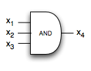
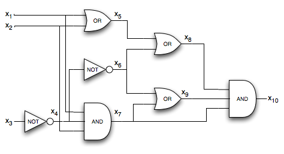
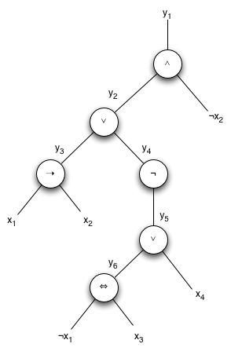
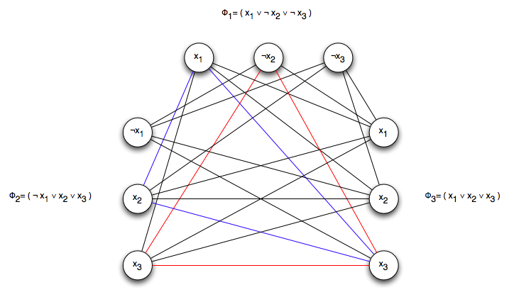

Last lecture presented the framework for *NP*-complete problems and showed that there is, in fact, at least one *NP*-complete problem. Using this one problem, we can show that other problems are also *NP*-complete using a technique known as *reducibility*. We can then *reduce* circuit satisfiability to other problems to show that the other problems are also *NP*-complete.

Reducibility
============

In order to show that a new problem is also *NP*-complete, we will construct a (polynomial time) *reduction* from an instance of a known *NP*-complete problem (e.g. circuit satisfiability) to an instance of the new problem. Thus if we could solve the new problem in polynomial time, we could solve the *NP*-complete problem in polynomial time by simply converting it to an instance of the new problem (in polynomial time), solving the new problem (in polynomial time), and then interpreting the decision result for the *NP*-complete problem (in polynomial time). Since every problem in *NP* can be represented as an instance of the original *NP*-complete problem, if we can show that every instance of the *NP*-complete problem can be reduced to an instance of the new problem, then the new problem must also be *NP*-complete (assuming the new problem is ∈ *NP* itself). This technique has been used to show many interesting problems are *NP*-complete.

Boolean Satisfiability
======================

Using circuit satisfiability as the initial *NP*-complete problem, we can show that *Boolean satisfiability* is *NP*-complete by reducing any instance of circuit satisfiability to Boolean satsifiability.

**Problem**

A Boolean expression is a formula composed of

> 1.  *n* Boolean variables *x*1, *x*2, ..., *x*n
> 2.  *m* Boolean operations consisting of ∧ (logical **AND**), ∨ (logical **OR**), ¬ (logical **NOT**), → (logical **implication**), and ⇔ (logical **if and only if**)
> 3.  parentheses

Parentheses delineate *clauses* that consist of a group of variables that are connected by operands. For example

> φ = (( *x*1 → *x*2 ) ∨ ¬ (( *x*1 ⇔ *x*3 ) ∨ *x*4 )) ∧ ¬ *x*2

Clearly an assignment that satisfies this expression is \<0, 0, 1, 1\>.

It can be shown that Boolean satisifiability is *NP*-complete by reducing circuit satisfiability to Boolean satisfiability.

*Proof*

While it would seem intuitive to simply write the Boolean expression for the circuit, this cannot necessarily be done in polynomial time if the gates have fan-out greater than two (i.e. the output of one gate goes to the input of more than 2 other gates). Instead what we do is represent each wire in the circuit by a Boolean variable *x*i. We then represent each gate by a clause giving the relationship of inputs to output. For example the clause for the following gate

> 

is given by *x*4 ⇔ ( *x*1 ∧ *x*2 ∧ *x*3 ).

We then construct the Boolean formula by simply **AND**'ing all the clauses with the output (which can be done in polynomial time). Clearly both the circuit satisfiability and Boolean satisfiability counterparts have the same resulting decision outputs. For example, the circuit given by

> 

would have the corresponding formula

> φ = *x*10 ∧ ( *x*4 ⇔ ¬ *x*3 )
>
> > ∧ ( *x*5 ⇔ ( *x*1 ∨ *x*2 ))
> >
> > ∧ ( *x*6 ⇔ ¬ *x*4 )
> >
> > ∧ ( *x*7 ⇔ ( *x*1 ∧ *x*2 ∧ *x*4 ))
> >
> > ∧ ( *x*8 ⇔ ( *x*5 ∨ *x*6 ))
> >
> > ∧ ( *x*9 ⇔ ( *x*6 ∨ *x*7 ))
> >
> > ∧ ( *x*10 ⇔ ( *x*7 ∧ *x*8 ∧ *x*9 ))

Thus if we could solve the Boolean satisfiability problem in polynomial time, we could solve the circuit satisfiablity problem in polynomial time (and by extension any *NP* problem in polynomial time).

3-CNF Satisfiability
====================

If the Boolean expression consists of *exactly* 3 **OR**'ed variables per clause with all the clauses being **AND**'ed, then the expression is said to be in *3-CNF* form (conjunctive normal form).

**Problem**

Given a 3-CNF expression, find an assignment of the literals that satisfies the expression, i.e. causes the expression to evaluate to 1. It can be shown that 3-CNF is also *NP*-complete by reducing general Boolean satisfiability to 3-CNF.

*Proof*

The reduction is performed in three steps:

*Step 1: Convert clauses into a binary parse tree*

Since each Boolean operator is a binary operator, we simply construct a binary parse tree where the nodes are the operators and the literals are leaves. In the case of clauses with multiple literals, we simply add associative paretheses as needed to make binary clauses. We then construct a new expression, similarly to the above reduction from circuit satisfiability to Boolean satisfiability, by **AND**'ing the clauses representing each node with the final output.

*Step 2: Convert each clause into CNF form*

We then construct a truth table for each clause (which contains at most 3 literals) and use the *sum-of-products* method to create an equivalent Boolean expression that evaluates to 0 in which we have a set of **AND**'ed clauses that consist of **OR**'ed literals (this is known as *DNF form* - disjunctive normal form). Finally we negate this expression and apply DeMorgan's law to convert this expression into the equivalent CNF form that evaluates to 1 if and only if the original expression evaluates to 1.

*Step 3: Ensure each clause has exactly 3 literals*

Finally we add auxilarly variables *p* and *q* as needed to clauses that have less than 3 literals as follows

> -   If the clause contains 3 literals, then keep it as is
> -   If the clause contains 2 literals, then create two **AND**'ed clauses that contain *p* and ¬ *p*. In other words, for the clause ( *x*i ∨ *x*j ) replace it with
>
>     > ( *x*i ∨ *x*j ∨ *p* ) ∧ ( *x*i ∨ *x*j ∨ ¬ *p* )
>
> > Since for any assignment of *p*, one of the clauses will evaluate to the original and the other will evaluate to 1 (thus not changing the final result of the original expression).
>
> -   If the clause contains 1 literal, then create four **AND**'ed clauses that contain *p* and ¬ *p* and *q* and ¬ *q*. In other words, for the clause ( *x*i ) replace it with
>
>     > ( *x*i ∨ *p* ∨ *q* ) ∧ ( *x*i ∨ ¬ *p* ∨ *q* ) ∧ ( *x*i ∨ *p* ∨ ¬ *q* ) ∧ ( *x*i ∨ ¬ *p* ∨ ¬ *q* )
>
> > Again since any assignment of *p* and *q* will make one of the clauses evaluate to the original and all the others evaluate to 1.

This procedure can be done in polynomial time since the first step adds at most one variable and one clause per operator in the original expression, the second step adds at most 8 clauses (since for 3 literals the truth table has 8 rows), and the third step adds at most 4 clauses. Thus the product of these steps remains a constant factor. Since the procedure basically applies the laws of discrete math, the final 3-CNF expression will be satisifiable if and only if the original Boolean expression is satisfiable.

**Example**

Consider the Boolean expression

> φ = (( *x*1 → *x*2 ) ∨ ¬ (( ¬ *x*1 ⇔ *x*3 ) ∨ *x*4 )) ∧ ¬ *x*2

*Step 1: Draw binary parse tree*

Parse the expression by creating the following output variables of subexpressions:

> *y*6 = ( ¬ *x*1 ⇔ *x*3 )
>
> *y*5 = ( *y*6 ∨ *x*4 )
>
> *y*4 = ( ¬ *y*5 )
>
> *y*3 = ( *x*1 → *x*2 )
>
> *y*2 = ( *y*3 ∨ *y*4 )
>
> *y*1 = ( *y*2 ∧ ¬ *x*2 )

Making each of the above operators a node gives the following parse tree

> 

Thus the original expression can be rewritten (by traversing the parse tree) as

> φ' = *y*1 ∧ ( *y*1 ⇔ ( *y*2 ∧ ¬ *x*2 ))
>
> > ∧ ( *y*2 ⇔ ( *y*3 ∨ *y*4 ))
> >
> > ∧ ( *y*3 ⇔ ( *x*1 → *x*2 ))
> >
> > ∧ ( *y*4 ⇔ ( ¬ *y*5 ))
> >
> > ∧ ( *y*5 ⇔ ( *y*6 ∨ *x*4 ))
> >
> > ∧ ( *y*6 ⇔ ( ¬ *x*1 ⇔ *x*3 ))

*Step 2: Convert each clause to CNF*

Constructing the truth table for the first clause φ'1 = *y*1 ⇔ ( *y*2 ∧ ¬ *x*2 )) gives

> **y**1 | **y**2 | **x**2 | (**y**1 ⇔ (**y**2 ∧ ¬**x**2)) |
> --- | --- | --- | --- |
>  0  |  0  |  0  |  1  |
>  0  |  0  |  1  |  1  |
>  0  |  1  |  0  |  0  |
>  0  |  1  |  1  |  1  |
>  1  |  0  |  0  |  0  |
>  1  |  0  |  1  |  0  |
>  1  |  1  |  0  |  1  |
>  1  |  1  |  1  |  0  |

Thus we can write ¬ φ'1 by simply **AND**'ing the literals (negating any false values) for each row that evaluates to 0 and **OR**'ing all the 0 rows (i.e. sum-of-products) giving

> ¬ φ'1 = ( ¬ *y*1 ∧ *y*2 ∧ ¬ *x*2) ∨ ( *y*1 ∧ ¬ *y*2 ∧ ¬ *x*2) ∨ ( *y*1 ∧ ¬ *y*2 ∧ *x*2) ∨ ( *y*1 ∧ *y*2 ∧ *x*2)

Finally we can compute the CNF form φ"1 = ¬ ( ¬ φ'1 ) and using DeMorgan's laws to convert **AND** to **OR** giving

> φ"1 = ( *y*1 ∨ ¬ *y*2 ∨ *x*2) ∧ ( ¬ *y*1 ∨ *y*2 ∨ *x*2) ∧ ( ¬ *y*1 ∨ *y*2 ∨ ¬ *x*2) ∧ ( ¬ *y*1 ∨ ¬ *y*2 ∨ ¬ *x*2)

For the clause φ'4 = ( *y*4 ⇔ ( ¬ *y*5 )) the truth table would be

> **y**4 | **y**5 | (**y**4 ⇔ ¬**y**5)) |
> --- | --- | --- |
>  0  |  0  |  0  |
>  0  |  1  |  1  |
>  1  |  0  |  1  |
>  1  |  1  |  0  |

The sum-of-products for ¬ φ'4 gives

> ¬ φ'4 = ( ¬ *y*4 ∧ ¬ *y*5 ) ∨ ( *y*4 ∧ *y*5 )

The CNF form for φ"4 = ¬ ( ¬ φ'4 ) gives

> φ"4 = ( *y*4 ∨ *y*5 ) ∧ ( ¬ *y*4 ∨ ¬ *y*5 )

*Step 3: Ensure each clause has exactly 3 literals*

Clearly all the clauses in φ"1 contain three literals, so that clause is unchanged. However for φ"4, the two clauses only contain 2 literals. Thus we add an auxilary variable *p* to both of them giving

> φ"'4 = ( *y*4 ∨ *y*5 ∨ *p* ) ∧ ( *y*4 ∨ *y*5 ∨ ¬ *p* ) ∧ ( ¬ *y*4 ∨ ¬ *y*5 ∨ *p* ) ∧ (¬ *y*4 ∨ ¬ *y*5 ∨ ¬ *p* )

Also note that the very first clause in φ' only contains one literal ( *y*1) so we expand using auxilary variables *p* and *q* giving

> φ"'0 = ( *y*1 ∨ *p* ∨ *q* ) ∧ ( *y*1 ∨ ¬ *p* ∨ *q* ) ∧ ( *y*1 ∨ *p* ∨ ¬ *q* ) ∧ ( *y*1 ∨ ¬ *p* ∨ ¬ *q* )

In this manner we convert the original expression into one that contains **AND**'ed clauses each with *exactly* 3 **OR**'ed literals.

Thus if we could solve 3-CNF in polynomial time we could solve general Boolean satisfiability in polynomial time (and by extension any *NP* problem in polynomial time).

Clique
======

The next *NP*-complete problem we will explore is a graph problem known as *clique*. For an undirected graph *G*, a *clique* is a subset of vertices that form a complete subgraph (i.e. a subset of vertices with every possible edge between all the vertices).

**Problem**

Given a graph *G*, find the *clique* with *maximal size*, i.e. the complete subgraph with the most vertices. Since this is an optimization problem, we cast it into a decision problem by asking if on a graph there is a clique of size *k*. It can be shown that the clique problem is *NP*-complete by reducing 3-CNF to an instance of clique.

*Proof*

The proof of the reduction from 3-CNF to clique is very interesting because it takes a Boolean expression and converts it into an equivalent graph even though the problems seem to stem from different mathematical domains. Again the proof is constructive. Assume that the 3-CNF expression has *k* clauses. We then construct a graph such that if the 3-CNF expression is satisfiable, then there will be a clique on the graph of size *k*.

*Step 1: Add vertices to the graph*

For each clause, add a vertices in the graph for each literal or negated literal (since each clause has exactly 3 literals there will be 3 vertices per clause in the graph giving a total of 3*k* vertices in the final graph).

*Step 2: Add edges between vertices*

Add edges between vertices under the following conditions

> -   The two vertices come from different clauses
> -   The vertices are *not* negations of each other

Using this procedure, it can be shown that if there is an assignment of literals for the 3-CNF formula then those literals will produce a clique of size *k*. Since at least one literal (or its negation) must be assigned 1 in the expression, these vertices will form a clique in the graph. Conversely, if there is a clique of size *k* then the clique will contain the literals that satisfy the 3-CNF formula. Since there are no edges between vertices from the same clause, assigning the vertices in the clique to 1 will give a satisfying assignment.

**Example**

Consider the following 3-CNF expression

> φ = ( *x*1 ∨ ¬ *x*2 ∨ ¬ *x*3 ) ∧ ( ¬ *x*1 ∨ *x*2 ∨ *x*3 ) ∧ ( *x*1 ∨ *x*2 ∨ *x*3 )

(clearly a satisfiable assignment is \< 0/1, 0, 1\>). The graph for the above expression is (with the size 3 clique shown in red)

> 

Note that another clique (indicated in blue) of size 3 would give the assignment \<1, 1, 1\> which also satisfies the 3-CNF expression.

Thus if we could solve clique in polynomial time we could solve 3-CNF in polynomial time (and by extension any *NP* problem in polynomial time).

