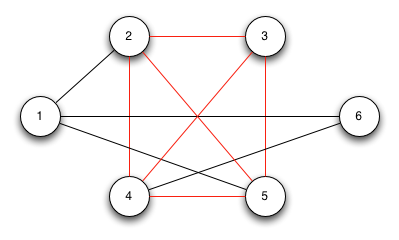
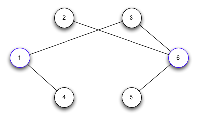
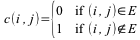
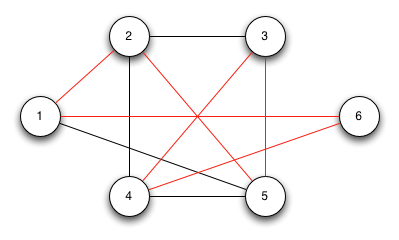
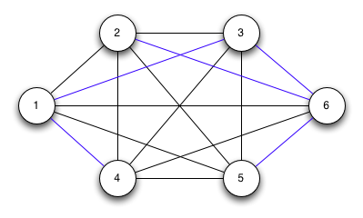

So far we have seen four *NP*-complete problems - circuit satisfiability, Boolean satisfiability, 3-CNF satisfiability, and clique. This lecture will discuss a few more *NP*-complete problems.

Vertex Cover
============

Another graph problem that can be shown to be *NP*-complete is *vertex cover*. A vertex cover is a subset of vertices that touch all the edges in an undirected graph.

**Problem**

Given an undirected graph *G*, find the *minimum* subset of vertices that touch *all* the edges, i.e. the minimum size vertex cover. Again we can express this optimization problem as the decision problem asking if there is a vertex cover of size *k*.

*Proof*

To prove vertex cover is *NP*-complete, we shall reduce any instance of clique to vertex cover using another constructive procedure. The procedure will involve constructing the *complement* graph, which is the graph G̅ that contains the edges *not* in the original graph, i.e. E̅ = {(*u*, *v*) : (*u*, *v*) ∉ *E* }. Then we will show that if the graph *G* has a clique of size *k*, then the complement graph G̅ has a vertex cover of size (\|*V*\| - *k*).

Assume *G* has a clique \|*V* '\| of size *k* and let (*u*, *v*) ∈ E̅ ⇒ either *u* or *v* ∉ \|*V* '\| (since if both *u* and *v* were in the clique there would have been an edge between them). Therefore either *u* or *v* must be in *V* - *V* ' ⇒ edge (*u*, *v*) is covered by *V* - *V* '. Thus every edge in E̅ is covered by a vertex in *V* - *V* ' which has size \|*V*\| - *k* (since the clique *V* ' has size *k*).

Conversely assume G̅ has a vertex cover *V* " of size \|*V*\| - *k*. Then if (*u*, *v*) ∈ E̅ ⇒ either *u* or *v* (or both) ∈ *V* " (one or both of the vertices must be in the vertex cover since they touch an edge in the complement graph). By the contrapositive, if *u* **and** *v* ∉ *V* " then (*u*, *v*) ∈ *E* ⇒ *V* - *V* " is a *clique* and has size \|*V*\| - \|*V* "\| = *k*.

**Example**

Consider the following graph (which has a clique of size 4 as shown in red)

> 

We first construct the complement graph G̅ giving

> 

Clearly a vertex cover for G̅ is {1,6} (shown in blue) which has size 6 - 4 = 2.

Thus if we could solve vertex cover in polynomial time we could solve clique in polynomial time (and by extension any *NP* problem in polynomial time).

Hamiltonian Cycle
=================

Another graph problem that is *NP*-complete is *hamiltonian cycle*. A *hamiltonian cycle* is a *simple* cycle that touches every *vertex* **exactly** once (except for the end point).

**Problem**

Given a graph *G*, find a simple cycle that touches every vertex exactly once.

*Proof*

To prove hamiltonian cycle is *NP*-complete, we will reduce any instance of vertex cover to hamiltonian cycle. The proof is beyond the scope of this course, but consists of constructing subgraphs known as *widgets* for each edge in the original graph. Furthermore *selector vertices* are added to connect widgets. It can then be shown that a vertex cover of all the vertices in the widgets and selector vertices produces a hamiltonian cycle following the edges connecting vertices represented in the widgets.

Thus if we could solve hamiltonian cycle in polynomial time we could solve vertex cover in polynomial time (and by extension any *NP* problem in polynomial time).

Traveling Salesman
==================

One of the most famous (and most studied) *NP*-complete problem is known as the *traveling salesman*. The name is derived from the problem that a salesman must visit each of *n* cities (i.e. make a hamiltonian tour) exactly once using the shortest path possible. It is obvious that this is a closely related problem to hamiltonian tour except with weighted edges (representing the *cost* or *distance* between cities).

**Problem**

Given a *complete* undirected graph *G* with non-negative integer weight edges *w*(*u*, *v*), find a tour that visits each vertex *exactly once* with *minimum weight*. Again we convert the optimization problem to the decision problem that a tour exists with weight at most *k*.

*Proof*

To prove that traveling salesman is *NP*-complete, we will reduce any instance of hamiltonian cycle to traveling salesman. Let *G* be a graph and construct the complete graph *G*' by adding any edges not in *G*. Weight the edges as follows:

> 

Graph *G* will have a hamiltonian cycle if and only if *G*' has a tour with 0 cost.

Suppose *G* has a hamiltonian tour *h*. Each edge of *h* belongs to *G* and thus has edge weight 0 in *G*' ⇒ the tour *h* in *G*' has total weight 0.

Conversely, suppose *G*' has a tour *h*' with weight 0. Since the edges in *G*' have weights either 0 or 1, if the weight of *h*' = 0 then every edge on *h*' = 0 (otherwise the weight of the tour would be positive). But only edges in *E* (the edges in *G*) have weights that are 0 and thus *h*' must be a tour in *G*, i.e. a hamiltonian tour.

**Example**

Consider the following graph (identical to the one used in the example for vertex cover) with the hamiltonian cycle {1, 2, 5, 3, 4, 6, 1}indicated in red

> 

Completing the graph such that the black edges (original ones) have weight 0 and blue edges (added ones) have weight 1, it is clear that the red path above has minimum weight 0 (e.g. path {1, 2, 3, 4, 5, 6, 1} would have weight 1).

> 

Thus if we could solve traveling salesman in polynomial time we could solve hamiltonian cycle in polynomial time (and by extension any *NP* problem in polynomial time).

Many other problems such as the knapsack problem, subset-sum, graph coloring, and traveling tournament have similarly been shown to be *NP*-complete. To this point there has not been any polynomial time solutions to any of these problems **OR** a proof that no polynomial time solution exists, thus *NP*-completeness remains one of the important open problems in computing.

However, often real world problems take the form of an *NP*-complete problem with sufficiently large *n* to make brute force infeasible. Never the less, a feasible solution is needed, even if it is suboptimal, and thus there has been much work in finding polynomial time *approximation algorithms* to find *good* solutions to otherwise *NP*-complete problems.

