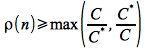
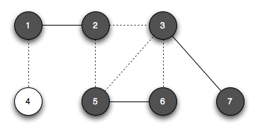
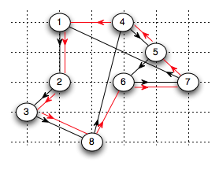

The last several lectures presented numerous *NP*-complete problems. While there is no efficient way of finding the optimal solution to several of them, e.g. traveling salesman, there are ways to efficiently find *approximate* solutions. It is interesting that while we may *not* know the optimal value, we *can* know how far (worst case) our approximate solution is from the optimal. In this final lecture we will look at a few approximation algorithms for vertex cover and traveling salesman that are based on polynomial time graph algorithms from this course.

Performance Ratio
=================

We define a quantity ρ(*n*) known as the *approximation ratio* as

> 

This ratio measures the ratio between the approximate solution and the optimal solution. Clearly the optimal solution has ρ(*n*) = 1. Thus if we can show a particular performance ratio for an approximation algorithm, we can say that the approximate solution is within a factor of ρ(*n*) of the optimal (again without knowing what the optimal value is). Such a solution is known as a ρ(*n*)-*approximation algorithm*.

Approximate Vertex Cover
========================

The first problem we will find an approximate solution to is vertex cover. As a review, the vertex cover problem is to find the minimum subset of vertices that touch every edge in a graph.

The following algorithm can find an approximate vertex cover that contains no more than *twice* the minimum number of vertices, i.e. is a 2-approximation algorithm.

**Algorithm**

The algorithm simply selects an edge (adding the endpoints to the vertex cover) and removes any other edges incident on its endpoints (since these are covered by the endpoints). It repeats this process until there are no more edges to remove. Clearly this algorithm runs in polynomial time (O(*E*)).

*Proof*

Clearly when the algorithm terminates, the set *C* will be a vertex cover (since all edges will be touched by a vertex). Assume the random edges the algorithm selects is the set *A*. To cover these edges, any vertex cover (including the optimal one *C*\*) needs to contain at least one endpoint for each edge. However in *A*, no two edges share an endpoint since once an edge is selected, all other edges incident to its endpoints are removed. Therefore, no two edges in *A* are covered by the same vertex from *C*\* giving

> \|*C*\*\| ≥ \|*A*\|

Because the algorithm selects edges with endpoints *not* currently in the set *C*, clearly (since every edge will have 2 distinct vertices)

> \|*C*\| = 2 \|*A*\|

Combining these two equations gives

> \|*C*\*\| ≥ \|*C*\| / 2
>
> ⇒ \|*C*\| ≤ 2 \|*C*\*\|

Hence the algorithm returns a vertex cover with no more than *twice* the number of vertices in an optimal vertex cover.

**Example**

Consider the following graph

> 

*Iteration 1*: Arbitrarily choose edge (1,2) so that *C* = {1, 2} (removing edges (1,4), (2,3) and (2,5))

> 

*Iteration 2*: Arbitrarily choose edge (5,6) so that *C* = {1, 2, 5, 6} (removing edges (2,5) and (3,5))

> 

*Iteration 3*: Arbitrarily choose edge (3,7) so that *C* = {1, 2, 5, 6, 3, 7} (removing edge (3,6))

> 

Hence the approximate vertex cover *C* = {1, 2, 5, 6, 3, 7} of size 6.

The optimal vertex cover (of size 3) is *C*\* = {1, 3, 5} as shown below

> 

Approximate Traveling Salesman
==============================

Another *NP*-complete problem that can be solved by a 2-approximation algorithm is traveling salesman. The traveling salesman problem is given a complete graph with nonnegative weight edge costs *c*(*u*, *v*), find a minimum weight simple tour (i.e. path that touches each vertex exactly once except for the endpoint). A special case of traveling salesman is a complete graph that satisfies the *triangle inequality* that for all vertices *u*, *v*, and *w* ∈ *V*

> *c*(*u*, *v*) ≤ *c*(*u*, *w*) + *c*(*w*, *v*)

basically that it is faster to go directly between two points than through an intermediate vertex. It can be shown that even by imposing this constraint on the graph that this version of traveling salesman is still *NP*-complete (and also that without this constraint that there is **no** good approximation algorithm unless *P* = *NP*).

The following algorithm, which utilizes Prim's algorithm for finding MST, can find a tour of weight no more than *twice* the optimal.

A preorder tree walk simply recursively visits vertices in the tree based on when they were discovered. This approximation algorithm runs in O(*V*2).

*Proof*

Let *H*\* be an optimal tour with cost *c*(*H*\*). Since we can construct a spanning tree from a tour by simply removing any edge (which for TSP is nonnegative), the cost of the MST *T* must be a lower bound on the cost of the optimal tour

> *c*(*T*) ≤ *c*(*H*\*)

Consider a *full* walk *W* that visits each vertex both upon the initial recursion and whenever the tour revisits the vertex as recursive branches are completed. Therefore each edge of *T* will be traversed *exactly* twice for *W* giving

> *c*(*W*) = 2 *c*(*T*)

Combining the above two equations gives

> *c*(*W*) ≤ 2 *c*(*H*\*)

However since the walk *W* visits some vertices more than once, it is *not* a tour. But since the graph satisfies the triangle inequality, removing any vertex from the walk will not increase the cost of the walk (since it will be lower cost to go direct). By repeatedly removing all but the first visit to each vertex, we obtain the preordered walk (that contains all the vertices once except for the root) giving a hamiltonian tour *H*. Since we only removed vertices from *W* (not increasing the cost at any step by the triangle inequality)

> *c*(*H*) ≤ *c*(*W*)

Finally combining this inequality with the previous one gives

> *c*(*H*) ≤ 2 *c*(*H*\*)

Thus the tour found by the algorithm will have cost at worst twice the optimal value.

**Example**

Consider the following (complete) graph where the edge weights are simply the Euclidean distances between the vertices (which clearly satisfies the triangle inequality)

> 

Running Prim's algorithm on this graph (starting with vertex 1) gives the following MST with the vertices labeled in order of removal from the priority queue (i.e. the order in which they were added to the MST).

> 

The full walk for this tree would be the path \<1, 2, 3, 2, 8, 2, 1, 4, 5, 6, 5, 7, 5, 4, 1\> shown below

> 

Removing vertices according to the preorder walk (when the vertex is first visited) gives the tour \<1, 2, 3, 8, 4, 5, 6, 7, 1\> shown below

> 

The optimal tour is shown below in red. The approximate tour has cost ≈ 19.1 whereas the optimal tour has cost ≈ 14.7.

> 

Another strategy that can also be shown to be a 2-approximation algorithm is a greedy approach where we simply start at any vertex and proceed by choosing the next closest vertex to any of those currently in the partial tour (from the ones that have not yet been visited) and inserting it into the tour.

